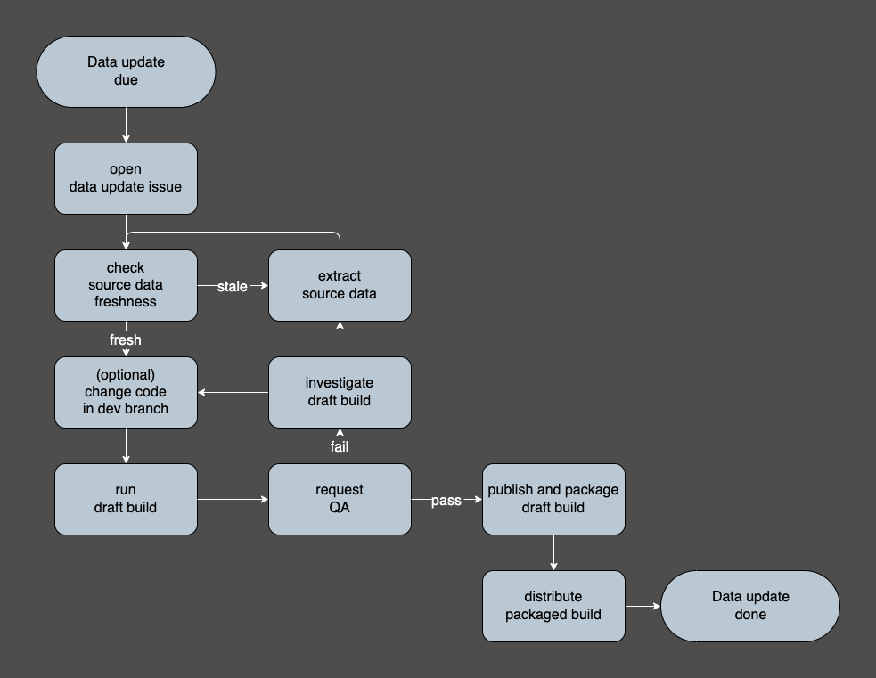

# Data Engineering Team

 

Primary repository for the Data Engineering team at NYC Department of City Planning (DCP). We build and maintain geospatial and tabular data products for internal and external use.

Also maintained: [Product Metadata](https://github.com/NYCPlanning/product-metadata) — specifications for DCP datasets.

## Repo structure

| Path | Purpose |
|---|---|
| `dcpy/` | Core Python package: lifecycle orchestration, connectors, utilities |
| `products/` | One folder per data product — code, dbt models, recipe files, README |
| `ingest_templates/` | YAML specs for extracting and archiving source datasets |
| `apps/` | Docker Compose services: nginx reverse proxy, QA/QAQC Streamlit app (`/qaqc`), Dagster orchestration UI (`/dag`), marimo notebook server |
| `docs/` | Technical reference (see below) |
| `experimental/` | Sandbox for prototyping; not production code |

## Data products

Each product lives under `products/<name>/` and follows a standard pipeline from source data to public distribution:

**Ingest → Build → Draft → QA → Publish**

1. **Ingest** — extract source datasets from APIs or files and archive to `edm-recipes` (S3)
2. **Build** — load archived data into Postgres, run dbt/SQL transforms
3. **Draft** — promote build output to the S3 `draft` folder; run automated QA checks
4. **QA** — domain experts and GIS team review; address issues and rebuild as needed
5. **Publish** — promote approved draft to the `publish` folder for distribution

For the full workflow including GIS team review and issue tracking conventions, see the [Data Update Workflow wiki page](https://github.com/NYCPlanning/data-engineering/wiki/Data-Update-Workflow).

## Getting started

See the [Developer Setup wiki page](https://github.com/NYCPlanning/data-engineering/wiki/Developer-Setup) for onboarding and the recommended Docker dev container. For manual (uv/venv) setup and Python dependency management, see [docs/development.md](docs/development.md).

## Technical reference (`docs/`)

- [dbt project conventions](docs/dbt/project_conventions.md) — model layers, materialization, geometry standards, linting
- [dcpy package structure](docs/dcpy/README.md) — module layers and import rules
- [dcpy architecture & import flow](docs/dcpy/architecture.md) — layered dependency model + `tach` enforcement
- [Test strategy](docs/testing.md) — suites, how to run them, conventions
- [Developer conventions](docs/conventions.md) — git/PR flow, formatting, comment tags
- [SQL reference](docs/sql-reference.md) — Postgres/MSSQL query and admin snippets
- [Local development](docs/development.md) — manual (uv/venv) setup and dependency management
- [Bash scripts & CLI tools](docs/bash/SCRIPTS.md) — available utilities on `PATH`

## Documentation & team resources (wiki)

The [wiki](https://github.com/NYCPlanning/data-engineering/wiki) covers team and operational content:
[About Us](https://github.com/NYCPlanning/data-engineering/wiki/About-Us) · [Cloud Infrastructure](https://github.com/NYCPlanning/data-engineering/wiki/Cloud-Infrastructure) · [Data Catalog](https://github.com/NYCPlanning/data-engineering/wiki/Data-Catalog) · [Environment Management](https://github.com/NYCPlanning/data-engineering/wiki/Environment-Management) · [Product pages](https://github.com/NYCPlanning/data-engineering/wiki/Home)
