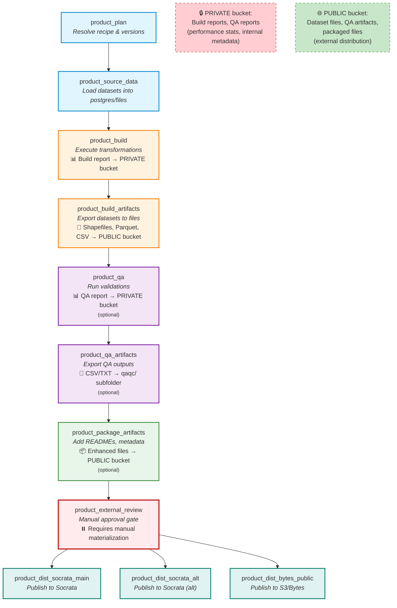
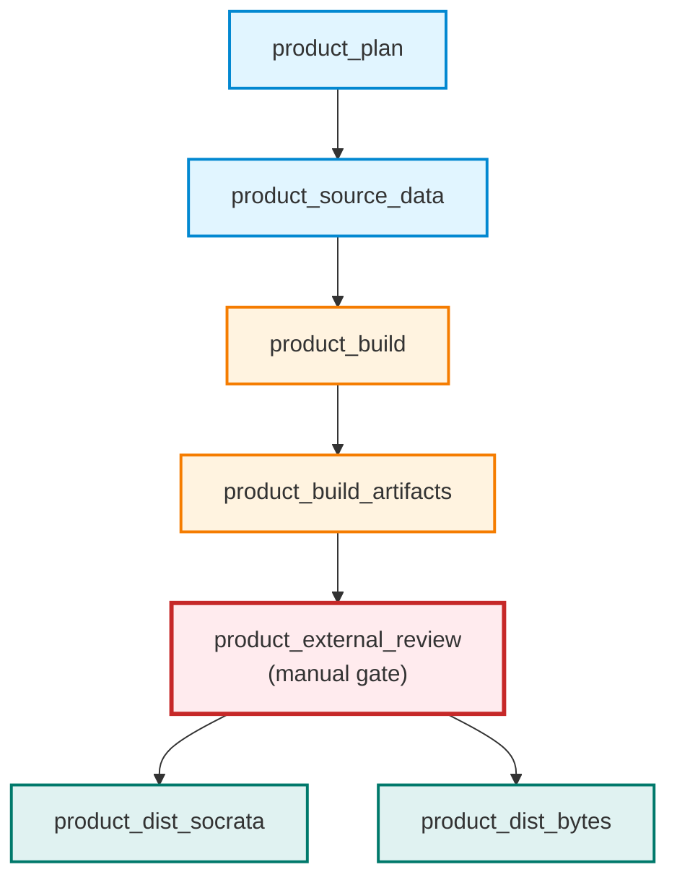
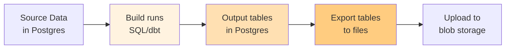
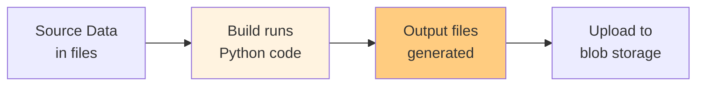
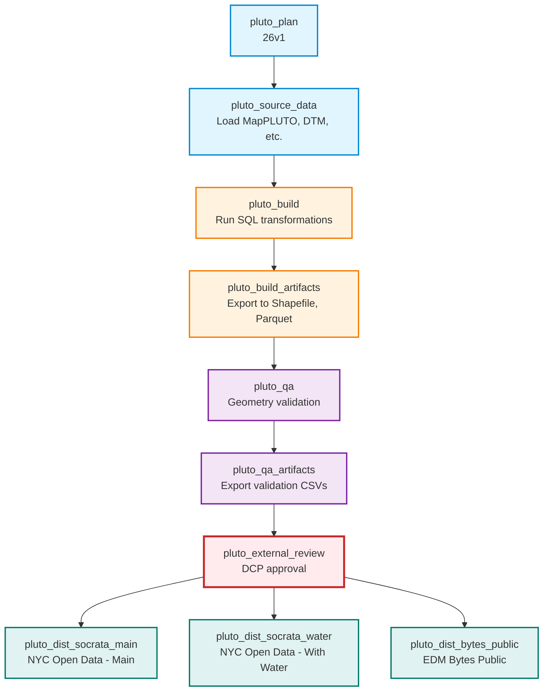

# Dagster Build Pipeline - Visual Overview

This diagram shows the complete asset lineage for a typical product in our Dagster implementation.

## Full Product Pipeline



## Simplified View (Minimal Pipeline)

For products without QA or packaging steps:



## Key Characteristics

### Linear Sequential Flow
- Plan → Source Data → Build → Build Artifacts → QA → QA Artifacts → Package → External Review
- Each step depends on the previous step completing

### Fan-Out at Distribution
- **All distribution assets run in parallel** after external review approval
- Independent destinations don't block each other
- Example: Socrata publish failure doesn't prevent S3 upload

### Materialized Assets vs. Side Effects

| Asset | Materialized Artifact | Side Effects (Ephemeral) |
|-------|----------------------|--------------------------|
| `product_plan` | recipe.lock.yml in blob storage | - |
| `product_source_data` | build_metadata.json | Postgres tables in build schema |
| `product_build` | Build report (PRIVATE bucket) | Postgres tables OR local files |
| `product_build_artifacts` | Dataset files (PUBLIC bucket) | - |
| `product_qa` | QA report (PRIVATE bucket) | QA validation tables |
| `product_qa_artifacts` | QA output files (PUBLIC bucket) | - |
| `product_package_artifacts` | Enhanced files (PUBLIC bucket) | - |
| `product_external_review` | Approval metadata | - |
| `product_dist_*` | Published artifacts | - |

### Asset Grouping in Dagster UI

All assets for a product are in one group:
- `group_name="pluto"` for all PLUTO assets (plan through distribution)
- `group_name="edde"` for all EDDE assets
- `group_name="ingest"` for ingest domain (separate)

**UI Benefit:** Click "pluto" in sidebar → see entire pipeline with lineage graph

### Optional Steps

Products can skip optional steps via recipe configuration:

```yaml
stage_config:
  qa:
    enabled: false  # Skip QA entirely

  package:
    enabled: false  # Skip package step
```

If disabled, dependency chain adjusts:
- No QA: `build_artifacts` → `external_review`
- No Package: `qa_artifacts` → `external_review`
- No QA or Package: `build_artifacts` → `external_review`

## Build Types

Different products can use different build approaches:

### SQL/DBT Build (Postgres-based)


### Python Build (File-based)


## Storage Strategy

### Private Bucket (Internal Only)
- Build reports (performance stats, logs)
- QA reports (validation details)
- Any operational/telemetry data

### Public Bucket (External Distribution)
- Exported dataset files (shapefiles, parquet, CSV)
- QA artifacts (validation outputs for review)
- Packaged files (with READMEs, metadata)

Path structure: `{product}/builds/{version}/[qaqc/]`
- Example: `pluto/builds/26v1/pluto_26v1.shp`
- Example: `pluto/builds/26v1/qaqc/validation_results.csv`

## Example: PLUTO Product

Concrete example with PLUTO:



**Partition:** `26v1`
**Group:** `pluto` (all assets)
**Tags:** `product=pluto`, `lifecycle_stage=builds.*` or `dist.publish`

## Questions?

- **Q: What if build fails?**
  A: Downstream assets blocked. Postgres schema remains for debugging. No automatic cleanup.

- **Q: Can I retry just the export step?**
  A: Yes! `build_artifacts` can be re-materialized independently if postgres tables still exist.

- **Q: What if one distribution destination fails?**
  A: Other destinations proceed independently (fan-out pattern). Fix and retry failed destination.

- **Q: How do I run the entire pipeline?**
  A: Use per-product job (e.g., `build_pluto_job`) or materialize `product_external_review` and select "Materialize upstream".

- **Q: Can I skip QA for a quick test build?**
  A: Set `stage_config.qa.enabled: false` in recipe or manually materialize `external_review` after `build_artifacts`.
