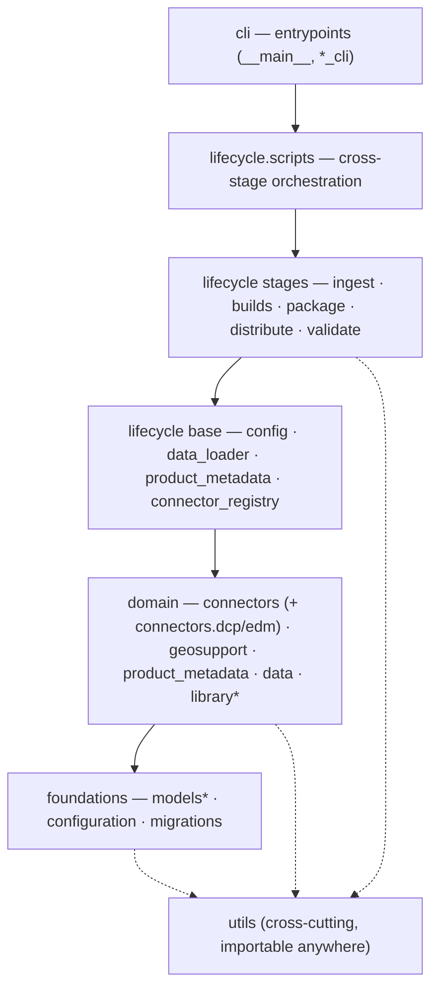

# dcpy Architecture & Import Flow

Depth companion to [`README.md`](./README.md) (the quick reference). This doc describes the
**desired** dependency direction between dcpy's submodules and how it's checked.

> [!NOTE]
> **First pass — provisional.** The layer assignments below and in [`tach.toml`](../../tach.toml)
> encode *intended* import direction; the team should review and confirm them. The dependency
> *facts* (what imports what, and the violations) are generated from the real code via `tach`.

## The layered model

dcpy is organized into layers. **A module may import from its own layer or a lower one, never a
higher one.** `utils` is a cross-cutting utility layer importable from anywhere. Read top-to-bottom
as "depends on what's below":



`*` = deprecated (`dcpy.models` for new code; `dcpy.library`, being replaced by `lifecycle.ingest`).

The full ordering, highest → lowest, is the `layers` list in [`tach.toml`](../../tach.toml):
`cli → scripts → stages → lifecycle_base → connectors_dcp → connectors → geosupport →
product_metadata → data → library → migrations → models → configuration → utils`.

## Submodules by layer

| Layer | Submodule(s) | Role |
|---|---|---|
| **cli** | `dcpy.__main__`, `dcpy.lifecycle._cli`, `dcpy.lifecycle._connectors_cli` | Typer entrypoints; may wire together anything below. |
| **scripts** | `dcpy.lifecycle.scripts` | Cross-stage glue and one-off targets (prefer here for code used across stages). |
| **stages** | `dcpy.lifecycle.{ingest,builds,package,distribute,validate}` | The lifecycle stages. Should avoid importing *each other*. |
| **lifecycle_base** | `dcpy.lifecycle.{config,data_loader,product_metadata,connector_registry}` | Shared wiring the stages build on. |
| **connectors_dcp** | `dcpy.connectors.edm` | DCP-specific connectors (`edm.recipes`, `edm.publishing`) that compose the generic ones. |
| **connectors** | `dcpy.connectors` (`registry`, `s3`, `web`, `socrata`, `esri`, `sftp`, …) | Atomic get/push to external systems; no business logic. |
| **geosupport** | `dcpy.geosupport` | Geosupport bindings / geocoding. |
| **product_metadata** | `dcpy.product_metadata` | Product/dataset metadata models, readers, writers. |
| **data** | `dcpy.data` | Dataset comparison and data helpers (e.g. `dcpy.data.compare`). |
| **library** | `dcpy.library` | **Deprecated** ingest/archive tool; being migrated to `lifecycle.ingest`. |
| **migrations** | `dcpy.migrations` | Database migration scripts. |
| **models** | `dcpy.models` | **Deprecated for new code.** Pydantic entity definitions; no dependencies on other submodules. |
| **configuration** | `dcpy.configuration` | Central runtime configuration. |
| **utils** | `dcpy.utils` | Pure, atomic utilities. No dependencies on other dcpy submodules. |

Today `dcpy.utils` and `dcpy.models` import **nothing** else in dcpy — the two foundations hold.

### Lifecycle stages

- **`ingest`** — extract, normalize, and archive source data to `edm-recipes`. `run.py` drives the
  template→archive flow: resolve version → download raw → archive → convert to parquet →
  preprocess/reproject → archive processed. Replaces `library`.
- **`builds`** — *prepares* a build: "plans" it from a product's
  [`recipe.yml`](../../products/green_fast_track/recipe.yml) and loads source datasets into the
  build Postgres DB. The transforms themselves run in the product folders (bash/sql/dbt); lifecycle
  code resumes afterward.
- **`package`** — bundles a build's outputs and metadata (annotations, attachments) for distribution.
- **`distribute`** — pushes exports to external destinations (mainly Socrata/OpenData).
- **`validate`** — quality checks.

`scripts` sits above the stages for cross-stage glue; prefer it for code shared across stages.

## Import rules

```python
# ✅ Allowed
from dcpy.utils import ...
from dcpy.library import ...  # in layer 2+ only
from dcpy.lifecycle.scripts import ...  # in lifecycle only

# ❌ Not allowed
from dcpy.lifecycle import ...  # in layer 1 or 2
from dcpy.models import ...  # anywhere (deprecated)
```

## The `models` tension

The intended design is one foundational `dcpy.models` package that every layer can reference
without circular imports. In practice, several packages keep their own `models.py`
(`lifecycle.builds.models`, `lifecycle.ingest.models`, `connectors.edm.models`, …), and these get
imported *upward* across layers. Most of the violations below are this pattern. Worth a team
decision: promote these to `dcpy.models` (or treat them as published interfaces) vs. accept the
coupling.

## Enforcement

[`tach.toml`](../../tach.toml) defines the layers above. It is **not yet wired into CI** — enabling
that would currently fail on the known deviations, so for now it's a **local check we run
ourselves** until the team confirms the target and the debt is triaged.

### Running it yourself

`tach` isn't a project dependency; run it on demand with `uvx` (no install needed):

```bash
uvx tach check          # list cross-layer violations (exits non-zero if any exist)
uvx tach show --web     # open an interactive dependency graph in the browser
```

For repeated use, install it once with `uv tool install tach`, then drop the `uvx` prefix.

**When to run it:** before opening or updating a PR that adds or moves imports under `dcpy/`.
Compare the output against the [known deviations](#known-deviations-to-review) below — those are
expected for now. **A violation that isn't on that list is one your change introduced:** fix the
import, or — if it's a deliberate, agreed boundary change — raise it with the team and update
`tach.toml` rather than silencing it.

> [!WARNING]
> Don't reach for `tach sync` to make `check` pass. It rewrites `tach.toml` to bless whatever
> imports currently exist, which would quietly legitimize the very violations we're trying to track.

## Known deviations (to review)

`tach check` currently reports these upward imports. Grouped by theme:

| Theme | Examples (`file:line` → disallowed import) | Likely disposition |
|---|---|---|
| Per-package `models.py` imported upward | `connectors/ingest_datastore.py:11` → `lifecycle.ingest.models`; `connectors/edm/publishing.py:29` → `lifecycle.builds.models`; `library/models.py:9` → `connectors.edm.models` | Promote shared models to `dcpy.models`, or treat as interfaces. |
| `connectors.edm` reaches into `lifecycle` | `connectors/edm/open_data_nyc.py:9` → `lifecycle.product_metadata` | Decide whether `edm` may depend on `lifecycle_base`, or invert. |
| Generic `connectors` imports `connectors.edm` | `connectors/ingest_datastore.py:8` → `connectors.edm.models` | Move shared types down out of `edm`. |
| `lifecycle_base` imports a stage | `lifecycle/data_loader.py:12` → `lifecycle.builds.models` | Base→stage inversion; relocate the model. |
| `product_metadata` ↔ `lifecycle.product_metadata` | `product_metadata/writers/oti_xlsx/xlsx_writer.py:16` → `lifecycle.product_metadata` | Clarify the split between the two `product_metadata` modules. |
| `dcpy.library` coupling (deprecated) | `library/config.py:10-12`, `library/validator.py:3`, `library/script/dob_cofos.py:4` → `connectors.*` | Resolves when `library` is removed; no action needed. |

Run `uvx tach check` for the authoritative, line-accurate list.
