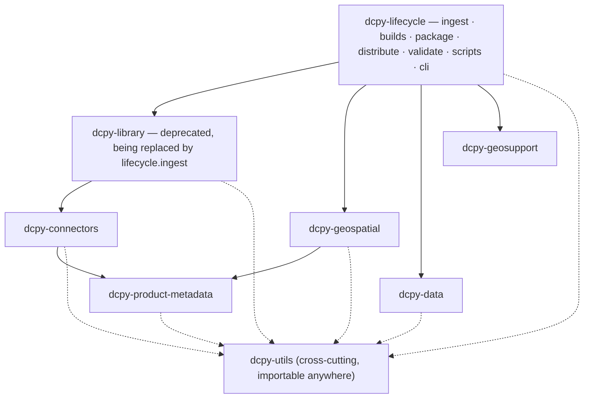

# dcpy Architecture & Import Flow

Depth companion to [`README.md`](./README.md) (the quick reference). This doc describes the
dependency direction between dcpy's packages and how it's enforced.

> [!NOTE]
> dcpy is split into separate installable packages under `python/*/` (`dcpy-utils`,
> `dcpy-connectors`, …), joined into one [uv workspace](../development.md) and merged into a single
> `dcpy` namespace package at import time. The package-level layering below (utils/geosupport →
> everything else → lifecycle) is enforced structurally — each package only declares the dcpy
> packages it actually depends on — not by a separate static-analysis config. See
> [Enforcement](#enforcement) for how that's checked. The finer-grained layers within
> `dcpy-lifecycle` itself (`cli`, `scripts`, `stages`, `lifecycle_base`) remain intended-only
> convention, since they aren't separate installable packages.

## The layered model

dcpy is organized into layers. **A package may import from its own layer or a lower one, never a
higher one.** `dcpy-utils` is a cross-cutting utility layer importable from anywhere. Read
top-to-bottom as "depends on what's below":


```mermaid
flowchart TD
    lifecycle["dcpy-lifecycle — ingest · builds · package · distribute · validate · scripts · cli"]
    library["dcpy-library — deprecated, being replaced by lifecycle.ingest"]
    connectors["dcpy-connectors"]
    geospatial["dcpy-geospatial"]
    data["dcpy-data"]
    product_metadata["dcpy-product-metadata"]
    geosupport["dcpy-geosupport"]
    utils["dcpy-utils (cross-cutting, importable anywhere)"]

    lifecycle --> library --> connectors --> product_metadata
    lifecycle --> geospatial --> product_metadata
    lifecycle --> data
    lifecycle --> geosupport
    product_metadata -.-> utils
    connectors -.-> utils
    geospatial -.-> utils
    data -.-> utils
    library -.-> utils
    lifecycle -.-> utils
```

Each edge above is a real `dependencies` entry in the downstream package's `pyproject.toml` — see
[Enforcement](#enforcement). `dcpy-geosupport` and `dcpy-utils` are the two foundations: neither
declares a dependency on any other dcpy package.

## Packages

| Package | Role |
|---|---|
| **`dcpy-lifecycle`** | Top of the hierarchy — the lifecycle stages (`ingest`, `builds`, `package`, `distribute`, `validate`), their shared base (`config`, `data_loader`, `product_metadata`, `connector_registry`), cross-stage `scripts`, `migrations`, and the CLI entrypoints (`dcpy.__main__`, `lifecycle._cli`, `lifecycle._connectors_cli`). May depend on every other package. |
| **`dcpy-library`** | **Deprecated** ingest/archive tool; being migrated to `lifecycle.ingest`. Depends on `dcpy-connectors`, `dcpy-utils`. |
| **`dcpy-connectors`** | Atomic get/push to external systems (`registry`, `s3`, `web`, `socrata`, `esri`, `sftp`, …) plus the DCP-specific `connectors.edm` (`edm.recipes`, `edm.publishing`) that composes them. Depends on `dcpy-product-metadata`, `dcpy-utils`. |
| **`dcpy-geospatial`** | Geospatial format conversion/comparison helpers. Depends on `dcpy-product-metadata`, `dcpy-utils`. |
| **`dcpy-data`** | Dataset comparison and data helpers (e.g. `dcpy.data.compare`). Depends on `dcpy-utils`. |
| **`dcpy-product-metadata`** | Product/dataset metadata models, readers, writers. Depends on `dcpy-utils`. |
| **`dcpy-geosupport`** | Geosupport bindings / geocoding. No dcpy dependencies. |
| **`dcpy-utils`** | Pure, atomic utilities, plus `dcpy.configuration` (central runtime configuration). No dcpy dependencies. |

Today `dcpy-utils` and `dcpy-geosupport` depend on **no other dcpy package** — the two foundations
hold.

Within `dcpy-lifecycle` itself, `cli → scripts → stages → lifecycle_base` is still a meaningful
internal layering (a stage shouldn't reach into another stage; `scripts` is for code shared across
stages) — but it's convention only, not a separately installable package, so nothing prunes an
import between them the way [Enforcement](#enforcement) does at the package level.

### Lifecycle stages

- **`ingest`** — extract, normalize, and archive source data to `edm-recipes`. `run.py` drives the
  template→archive flow: resolve version → download raw → archive → convert to parquet →
  preprocess/reproject → archive processed. Replaces `library`.
- **`builds`** — *prepares* a build: "plans" it from a product's
  [`recipe.yml`](../../products/green_fast_track/recipe.yml) and loads source datasets into the
  build Postgres DB. The transforms themselves run in the product folders (bash/sql/dbt); lifecycle
  code resumes afterward.
- **`package`** — bundles a build's outputs and metadata (annotations, attachments) for distribution.
- **`distribute`** — pushes exports to external destinations (mainly Socrata/OpenData).
- **`validate`** — quality checks.

`scripts` sits above the stages for cross-stage glue; prefer it for code shared across stages.

## Import rules

```python
# ✅ Allowed
from dcpy.utils import ...              # importable from any package
from dcpy.product_metadata import ...   # from dcpy-connectors, dcpy-geospatial, dcpy-lifecycle, ...
from dcpy.lifecycle.scripts import ...  # from within dcpy-lifecycle itself only

# ❌ Not allowed
from dcpy.lifecycle import ...   # from dcpy-utils, dcpy-connectors, etc. — not a declared dependency
from dcpy.connectors import ...  # from dcpy-utils, dcpy-data, etc. — not a declared dependency
```

An import that crosses one of these boundaries isn't just against convention — see
[Enforcement](#enforcement) below for why it fails outright once a package is synced on its own.

## Per-package `models.py`

There's no single foundational `dcpy.models` package. Every package keeps its own `models.py`
(`lifecycle.builds.models`, `lifecycle.ingest.models`, `connectors.edm.models`, `library.models`,
`utils.models`, …), and that's the accepted design — not a gap to close. Most of these stay inside
their own package. The exception is a couple of `lifecycle.*.models` modules that get imported
*upward* by `dcpy-connectors` and `dcpy-product-metadata` — see [Known deviations](#known-deviations-to-review).

## Enforcement

Each package declares the dcpy packages it actually depends on in its own `pyproject.toml`
(`[project].dependencies`), and that declaration is what's enforced — not a separate lint config.
`uv sync --package dcpy-X` installs only `X` and its declared dependencies into the shared venv,
pruning everything else; an import that reaches outside that set then fails with
`ModuleNotFoundError` at test collection time, not just a warning.

Each package also carries a `test/test_package_boundary.py` that asserts the packages above it in
the hierarchy raise `ImportError` when the package is synced in isolation — e.g.
[`python/connectors/test/test_package_boundary.py`](../../python/connectors/test/test_package_boundary.py)
asserts `dcpy-connectors` cannot import `dcpy.lifecycle`.

### Running it yourself

```bash
bash/run_isolated_tests.sh
```

This mirrors the `pytest_dcpy` job in
[`test_helper.yml`](../../.github/workflows/test_helper.yml): it syncs each `python/*/` package on
its own (`uv sync --package dcpy-<name>`) and runs that package's tests against the pruned venv, so
a test can only pass by importing a sibling package if that package is a real, declared dependency.
See [testing.md](../testing.md) for the full CI breakdown.

**When to run it:** before opening or updating a PR that adds or moves imports under
`python/*/dcpy/`. A boundary violation shows up as a collection failure for the offending
package's tests — fix the import, or — if it's a deliberate, agreed boundary change — add the
dependency to that package's `pyproject.toml` rather than working around the missing import.

## Known deviations (to review)

Two real, currently-undeclared *upward* imports are carved out in `bash/run_isolated_tests.sh` /
`test_helper.yml` (both packages are synced together with `dcpy-lifecycle` so their tests can even
collect), and each is tracked as an `xfail`-marked case in that package's `test_package_boundary.py`
so the suite fails loudly if it's ever fixed without removing the marker. A third, unrelated gap —
an undeclared *third-party* dependency — is carved out the same way:

| Theme | Where | Likely disposition |
|---|---|---|
| `dcpy-connectors` reaches into `dcpy-lifecycle` | `connectors/ingest_datastore.py`, `connectors/edm/open_data_nyc.py`, `connectors/edm/publishing.py` → `dcpy.lifecycle.*` | Resolves when `dcpy-library` is removed / the shared models are relocated. |
| `dcpy-product-metadata` reaches into `dcpy-lifecycle` | `product_metadata/writers/oti_xlsx/xlsx_writer.py` → `dcpy.lifecycle.product_metadata` | Clarify the split between the two `product_metadata` modules. |
| `dcpy-utils` has an undeclared runtime dependency on `geopandas` | `dcpy.utils.postgres` imports `geopandas`, which isn't declared in `dcpy-utils`'s `pyproject.toml` — declaring it would drag GDAL into every consumer | Needs an actual decision (lazy import? move the geospatial bits out of `dcpy-utils`?); `python/utils/test/test_postgres.py` is excluded from the isolated run in the meantime. |

Run `bash/run_isolated_tests.sh` for the authoritative, current list.
