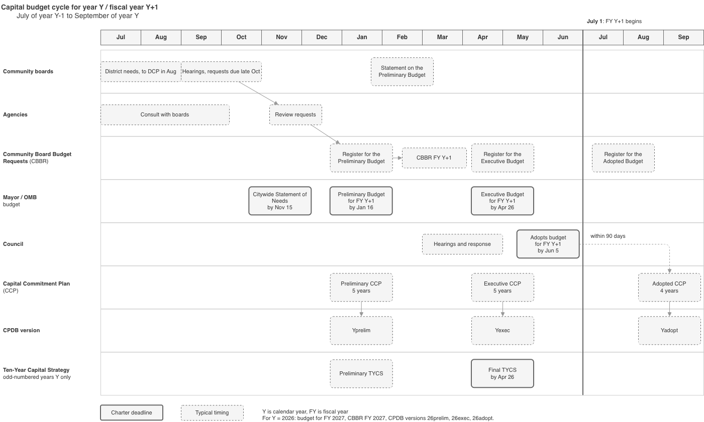
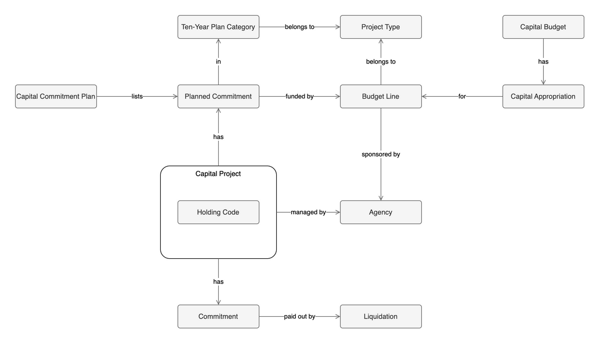

# Capital Planning Glossary

Terms and timelines for New York City's capital budget and the capital planning documents built from it.

For the physical things capital money is spent on, see **Capital Asset** in the [Urban Planning Glossary](glossary-urban-planning.md).

## Budget cycle

The city's budget follows the **Fiscal Year**, July 1 through June 30.
Each budget takes more than a year, from community boards assessing needs the summer before to the Adopted Capital Commitment Plan the September after the fiscal year starts.
Cycles overlap: boards start on the next budget before the current one is adopted ([OMB community board manual][cb-manual]).

The table follows one cycle, for the budget of fiscal year Y+1, where Y is a calendar year.
Dates with "by" are deadlines, from the Charter or OMB's community board manual. The manual copy is from 2015, so its dates may have drifted.

| When | Event | Source |
|---|---|---|
| June to August, Y-1 | Community boards assess district needs and submit District Needs Statements to DCP in August | [CB manual][cb-manual] |
| Late spring to early October, Y-1 | Community boards consult with agencies: district level in late spring, borough level in September and early October | [CB manual][cb-manual] |
| September to October, Y-1 | Community boards hold public hearings on budget requests and district needs | [CB manual][cb-manual] |
| Late October, Y-1 | Community boards submit **Community Board Budget Requests** to OMB, by a date OMB sets | [CB manual][cb-manual] |
| Early November to mid-December, Y-1 | OMB sends the requests to agencies, which review them as part of their **Departmental Estimates** and return responses | [CB manual][cb-manual] |
| By November 15, Y-1 | Mayor submits the **Citywide Statement of Needs** | [Charter §204][charter-204] |
| January (by Jan 16), Y | Mayor releases the **Preliminary Budget**, including the Preliminary Capital Budget and departmental estimates. OMB sends boards the **Register of Community Board Budget Requests** for the Preliminary Budget | [IBO][ibo], [Comptroller][comptroller], [CB manual][cb-manual] |
| January, Y | OMB publishes the Preliminary **Capital Commitment Plan**, a five-year plan | [Comptroller][comptroller] |
| January, odd-numbered Y | Preliminary **Ten-Year Capital Strategy** | [Comptroller][comptroller] |
| By February 15, Y | Community boards send their Statement on the Preliminary Budget | [CB manual][cb-manual] |
| February to April, Y | DE builds CBBR for FY Y+1 from the requests and agency responses | [#1474][cbbr-fy26], [#1856][cbbr-fy27] |
| March to April, Y | Council analyzes the Preliminary Budget, holds public hearings, and releases its response | [Council][council] |
| April (by Apr 26), Y | Mayor presents the **Executive Budget**, including the Executive Capital Budget. OMB sends boards the register for the Executive Budget | [IBO][ibo], [Comptroller][comptroller], [CB manual][cb-manual] |
| April or May, Y | OMB publishes the Executive Capital Commitment Plan, a five-year plan | [Comptroller][comptroller] |
| April or May, odd-numbered Y | Final Ten-Year Capital Strategy | [IBO][ibo], [Comptroller][comptroller] |
| May to June (by Jun 5), Y | Council and Mayor negotiate, then Council votes to adopt the **Adopted Budget**, including the Capital Budget | [Council][council], [IBO][ibo] |
| After adoption, Y | OMB publishes the register for the Adopted Budget | [CB manual][cb-manual] |
| July 1, Y | Fiscal year Y+1 begins. The Adopted Budget must be in place before then | [Council][council], [Comptroller][comptroller] |
| September, Y | OMB publishes the Adopted Capital Commitment Plan, a four-year plan due within 90 days of the Capital Budget's adoption | [Comptroller][comptroller], [OMB][omb] |

OMB also releases a November Financial Plan, which updates the current fiscal year's estimates ([IBO][ibo]).

### Recent release dates

OMB release dates, grouped the way OMB's publications pages group them: by the fiscal year they were released in.
The Preliminary, Executive, and Adopted columns are the financial plans released with each budget, and each of those budgets is for the next fiscal year.

| Released in | November Financial Plan | Preliminary | Executive | Adopted | September CCP |
|---|---|---|---|---|---|
| FY 2022 | 11/30/2021 | 02/16/2022 | 04/26/2022 | 06/13/2022 | 10/22/2021 |
| FY 2023 | 11/15/2022 | 01/12/2023 | 04/26/2023 | 06/30/2023 | 09/12/2022 |
| FY 2024 | 11/16/2023 | 01/16/2024 | 04/24/2024 | 06/30/2024 | 09/28/2023 |
| FY 2025 | 11/20/2024 | 01/16/2025 | 05/01/2025 | 06/30/2025 | 09/30/2024 |
| FY 2026 | 11/17/2025 | 02/17/2026 | 05/12/2026 | 06/30/2026 | 09/30/2025 |

Source: [OMB publications][omb], one page per fiscal year.
Those pages list only the September Capital Commitment Plan unless "View All" is expanded.
Where the Comptroller lists January and April or May plan dates (FY 2023 to FY 2025), each matches the financial plan's release date ([Comptroller][comptroller], Table 1).
The Charter dates are deadlines, and releases sometimes miss them: the Preliminary came out in February in FY 2022 and FY 2026, and the Executive in May in FY 2025 and FY 2026.

## Version labels

The same release can carry three different year labels:

- **Budgets** are named for the fiscal year they fund. OMB lists the May 2026 Executive Budget as Fiscal Year 2027 ([OMB][omb]).
- **OMB and the Comptroller** group publications by the fiscal year they're released in. The September 2025 plan is on OMB's FY 2026 page, and the Comptroller calls it the "FY 2026 Adopted CCP" ([OMB][omb], [Comptroller][comptroller]).
- **CPDB** versions (`version` in `products/cpdb/recipe.yml`) use the calendar year the plan was released in. The `ccpversion` column in CPDB outputs is different: it's `fisa_` plus FISA's cycle fiscal year (`fisa_2026` for `26exec`).
- **CBBR** versions use the fiscal year of the budget the requests are for: CBBR FY2027 was built in spring 2026 ([#1856][cbbr-fy27]).

| Plan | OMB release | FISA extract date | CPDB version | Released in | Budget it accompanies |
|---|---|---|---|---|---|
| Adopted | 09/30/2025 | 2025-09-30 | `25adopt` | FY 2026 | FY 2026 Adopted |
| Preliminary | 02/17/2026 | 2026-02-18 | `26prelim` | FY 2026 | FY 2027 Preliminary |
| Executive | 05/12/2026 | 2026-05-18 | `26exec` | FY 2026 | FY 2027 Executive |

FISA extract dates come from `ingest_templates/fisa_capitalcommitments.yml` history.
CPDB and fiscal-year-of-release labels differ only for Adopted plans.
Budget labels are one year ahead for Preliminary and Executive plans.

## Terms

### Time

**Fiscal Year**: A fiscal year is a 12-month accounting period that begins July 1 and ends the following June 30. Each fiscal year is named for the calendar year it ends in: fiscal year 2022 began in July 2021 and ended in June 2022. ([IBO][ibo])

### Budget stages

**Preliminary Budget**: The preliminary budget is the Mayor's proposed operating and capital expenditures and revenue forecast for the upcoming fiscal year plus the three after it, released by January 16. ([IBO][ibo])

**Executive Budget**: The executive budget is the Mayor's revised budget proposal for the upcoming fiscal year, presented to the Council by April 26 after the Council responds to the Preliminary Budget. ([IBO][ibo], [Council][council])

**Adopted Budget**: The adopted budget is the budget the Council votes to adopt after negotiating with the Mayor, due by June 5 and required before the fiscal year starts on July 1. ([IBO][ibo], [Council][council])

### Capital documents

**Capital Budget**: The capital budget sets the maximum capital appropriations, by budget line, that sponsor agencies can spend in the upcoming fiscal year, and projects appropriations for the three years after. It's released three times a year with the Preliminary, Executive, and Adopted Budgets. It works more as a spending limit than a plan. A project must be worth at least $50,000 to be included and, for most projects, have a period of probable usefulness of at least five years. ([Comptroller][comptroller], [IBO][ibo])

**Capital Commitment Plan**: The capital commitment plan (CCP) is OMB's schedule of **Planned Commitments** by FMS ID over the next four or five fiscal years. It's more granular than the Capital Budget, and the Comptroller calls it the more important planning document of the two. OMB publishes it three times a year as a multi-volume PDF. CPDB is built from one release of it, using FISA data that runs ten fiscal years rather than the PDF's four or five. ([Comptroller][comptroller], [CPDB data dictionary][cpdb-dd])

**Reserve for Unattained Commitments**: The reserve for unattained capital commitments is a lump-sum reduction in the Capital Commitment Plan that brings each fiscal year's planned commitments down to a realistic level, since OMB and agencies plan more than they can take on. It isn't broken out by project or agency, so project and agency totals from the plan add up to more than the plan's bottom line. ([Comptroller][comptroller])

**Ten-Year Capital Strategy**: The ten-year capital strategy (TYCS) is the Mayor's ten-year schedule of planned commitments, with the city's goals, key investments, and financing plan. A preliminary version comes out in January of odd-numbered years and the final version in April or May. It reports amounts by project type and **Ten-Year Plan Category**, and summarizes them into three lifecycle categories: state of good repair, program expansion, and programmatic replacement. It's separate from the Adopted Capital Budget and the Capital Commitment Plan. ([Comptroller][comptroller], [IBO][ibo], [TYCS FY 2026-2035][tycs-pdf], [Ten-Year Capital Strategy site][tycs])

**Ten-Year Plan Category**: A ten-year plan category (`typc`) is a category of work within a project type, like "Fair Bridges" or "Primary Street Reconstruction". Each planned commitment has one, and the Ten-Year Capital Strategy reports its amounts by project type and category. A category code is only unique within its project type. ([TYCS on Open Data][tycs-od], [CPDB data dictionary][cpdb-dd])

### Community input

**Statement of Community District Needs**: A statement of community district needs is a community board's statement of its district's long-range needs. Boards submit them to DCP in August, and DCP publishes them. ([CB manual][cb-manual])

**Community Board Budget Request**: A community board budget request is a board's request for capital or expense funding in the next fiscal year's budget. Each board votes separate priorities for up to 40 capital and 25 expense requests. DE's CBBR product is built from them. ([CB manual][cb-manual], [CBBR README](../products/cbbr/README.md))

**Register of Community Board Budget Requests**: The register of community board budget requests is OMB's publication of responses to every community board budget request. The Preliminary Budget register has agency responses, the Executive Budget register has OMB's recommendations, and the Adopted Budget register has the outcome. OMB publishes all three editions on [Open Data][register-od], one row per request per edition. DE's CBBR uses only the Preliminary Budget edition. ([CB manual][cb-manual], [Open Data][register-od])

**Departmental Estimates**: Departmental estimates are agencies' budget estimates, published with the Preliminary Budget. Agencies review community board budget requests as part of preparing them. ([CB manual][cb-manual])

**Citywide Statement of Needs**: The citywide statement of needs is the Mayor's list of new city facilities and significant expansions, and of facilities to close or significantly reduce, planned for the next two fiscal years. It's due by November 15. ([Charter §204][charter-204])

### Money

**Appropriation**: An appropriation is the amount of money identified in the budget for spending by an agency. ([IBO][ibo])

**Capital Appropriation**: A capital appropriation is the amount of money allocated to a specific budget line in the Capital Budget. ([IBO][ibo])

**Allocation**: An allocation is a sum of money within an appropriation that is set aside for a specific purpose. ([IBO][ibo])

**Planned Commitment**: A planned commitment is a commitment an agency expects to make, listed in the Capital Commitment Plan with a planned month and year, amounts by funding source (city exempt and non-exempt, state, federal, other), and what it pays for, such as design or construction. Most planned months are June, the last month of a fiscal year, so the date mostly marks a fiscal year. Even that is only somewhat reliable. ([CPDB data dictionary][cpdb-dd], [Comptroller][comptroller], [CPDB commitments][cpdb-commitments])

**Commitment**: A commitment is an awarded contract for capital spending, often covering several years, that has been registered with the City Comptroller. ([IBO][ibo], [Comptroller][comptroller])

**Liquidation**: A liquidation is a payment drawn down from a commitment's contract. It's the actual spending, and what Checkbook NYC's capital checks record. ([Comptroller][comptroller], [CSDB README](../products/checkbook/README.md))

### Projects and agencies

**Capital Project**: A capital project is the unit OMB plans commitments against, identified by an FMS ID (`maprojid` in CPDB, the managing agency code followed by a project ID). It has one or more planned commitments. An FMS ID isn't always a discrete project: some are holding codes, some are lump sums for a whole program or agency, and some are split by fiscal year. ([CPDB data dictionary][cpdb-dd], [Comptroller][comptroller])

**Holding Code**: A holding code is an FMS ID that holds planned commitments for a larger citywide program until they're moved to more specific FMS IDs, where the actual commitments and liquidations happen. FMS doesn't link a holding code to the IDs it's later spent under. ([Comptroller][comptroller])

**Budget Line**: A budget line is the Capital Budget's unit of appropriation, broader than an FMS ID. Each planned commitment is funded by one budget line, and one FMS ID can draw on several. CPDB writes it `HB-0215` and OMB's Capital Budget data writes it `HB 0215`. The character after the project type often says where the money came from: `D` lines are City Council funding, borough letters (`M`, `X`, `K`, `Q`, `R`) are borough-specific and often Borough President funding, and a second letter `N` (`DN`, `MN`, …) marks a line for one named organization. This is inferred from line titles and data, not documented. ([Comptroller][comptroller], [CPDB data dictionary][cpdb-dd], [Capital Budget][capbud-od], [City Council Capital Budget][council-capbud-od])

**Project Type**: A project type is the capital program a budget line belongs to, identified by the budget line's prefix (`BR` in `BR-0253`). The Ten-Year Capital Strategy reports by project type, and its categories (`typc`) only mean something within one: `REH` is "Rehabilitation of School Components" under `E` and "Social Services Buildings" under `HR`. The strategy sometimes combines project types into one program, like `BR and HB` for DOT's waterway and highway bridges. ([TYCS on Open Data][tycs-od], [CPDB data dictionary][cpdb-dd], [CPDB commitments][cpdb-commitments])

**Sponsor Agency**: A sponsor agency is the city agency sponsoring a capital project's planned commitments, derived from the budget line. The Capital Budget tells sponsor agencies how much they can spend. ([CPDB data dictionary][cpdb-dd], [Comptroller][comptroller])

**Managing Agency**: A managing agency is the city agency that manages a capital project, identified by the three-digit code at the start of its FMS ID. ([CPDB data dictionary][cpdb-dd])

**Financial Management System**: The Financial Management System (FMS) is the city's internal financial system and the authoritative source of capital financial data. It holds TYCS and CCP planned commitments plus actual commitments and liquidations by FMS ID. It doesn't hold project schedules or reasons for delays. ([Comptroller][comptroller])

## Relationships

Sponsor and managing agencies are both the **Agency** entity from the [Urban Planning Glossary](glossary-urban-planning.md), in different roles.
As in that glossary, cardinality is left blank for `is a` rows.

| Entity | Relationship | Cardinality | Entity |
|---|---|---|---|
| Holding Code | is a | | Capital Project |
| Capital Budget | has | 1 : 1..N | Capital Appropriation |
| Capital Appropriation | for | 0..N : 1 | Budget Line |
| Capital Commitment Plan | lists | 1 : 1..N | Planned Commitment |
| Capital Project | has | 1 : 1..N | Planned Commitment |
| Planned Commitment | funded by | 0..N : 1 | Budget Line |
| Planned Commitment | in | 0..N : 1 | Ten-Year Plan Category |
| Ten-Year Plan Category | belongs to | 0..N : 1 | Project Type |
| Budget Line | belongs to | 0..N : 1 | Project Type |
| Budget Line | sponsored by | 0..N : 1 | Agency |
| Capital Project | managed by | 0..N : 1 | Agency |
| Capital Project | has | 1 : 0..N | Commitment |
| Commitment | paid out by | 1 : 0..N | Liquidation |

Budget lines belong to planned commitments, not projects, so a project can span several budget lines and sponsor agencies.
In CPDB's [commitments dataset][cpdb-commitments], many projects have more than one budget line and some have more than one sponsor agency, while every budget line has exactly one sponsor agency.

Each Capital Commitment Plan release lists its own planned commitments, so the same project shows up again in every plan.
Within one plan, a planned commitment is unique on project, budget line, planned month, `commitmentcode`, and `typc` (the Ten-Year Plan Category). That holds in CPDB's commitments dataset, and without `typc` some combinations repeat.

## Examples

Each source has its own grain, and they connect through only a few keys.

| Source | One row per | Joins on |
|---|---|---|
| Ten-Year Capital Strategy | release, project type, category, funding source | project type + category |
| Capital Commitment Plan | plan, project, budget line, planned month, commitment code, category | project type + category, `maprojid` |
| Checkbook NYC | payment line | `maprojid` (first 12 characters of `capital_project`) |

In each table below, a row is one record and the columns are the keys it carries. A blank means that source doesn't have the key.
The strategy has category names, not `typc` codes, and Checkbook rows are summed by contract.
Amount is the ten-year all-funds total for a strategy row, the planned amount for a plan row, and the sum of payments for a Checkbook row.

### FDNY: ePCR equipment replacement

| Source | Project type | Category | `budgetline` | `maprojid` | `plancommdate` | `commitmentcode` | `contract_id` | Amount |
|---|---|---|---|---|---|---|---|---|
| Strategy | F | Electronics and Data Processing | | | | | | $101M |
| Plan | F | EDP | F-0212 | 057F212EPCR2 | 2026-06 | EQFN | | $2.08M |
| Plan | F | EDP | F-0212 | 057F212EPCR2 | 2027-06 | EQFN | | $37K |
| Checkbook (8 rows) | | | | 057F212EPCR2 | | | DO105720262006226 | $1.70M |

One budget line, one category, one contract. Payments started in March 2026, before the June 2026 planned commitment.

### Bridges: Woodhaven Blvd over Atlantic Ave

| Source | Project type | Category | `budgetline` | `maprojid` | `plancommdate` | `commitmentcode` | `contract_id` | Amount |
|---|---|---|---|---|---|---|---|---|
| Strategy | BR and HB | Bridge Life Extension and Miscellaneous Work | | | | | | $4.87B |
| Plan | HB | BLE | HB-0215 | 841HBQ8019 | 2027-06 | DSGN | | $2.93M |
| Plan | HB | BLE | HB-0215 | 841HBQ8019 | 2029-06 | CNSP | | $7.59M |
| Plan | HB | BLE | HB-0215 | 841HBQ8019 | 2030-06 | CONS | | $50.1M |
| Plan | HB | BLE | HB-0215 | 841HBQ8019 | 2030-06 | SVCS | | $3.62M |
| Checkbook (9 rows) | | | | 841HBQ8019 | | | CT184120248805915 | $931K |

Every planned commitment is in June 2027 or later, but design payments started in June 2025. The plan only schedules commitments still to come.

### HPD: West 108th Street Apartments

| Source | Project type | Category | `budgetline` | `maprojid` | `plancommdate` | `commitmentcode` | `contract_id` | Amount |
|---|---|---|---|---|---|---|---|---|
| Strategy | HD | New Housing Construction | | | | | | $8.08B |
| Plan | HD | NEW | HD-D021 | 806SW108 | 2025-12 | CONS | | $500K |
| Plan | HD | NEW | HD-M020 | 806SW108 | 2025-12 | CONS | | $1.00M |
| Plan | HD | NEW | HD-M020 | 806SW108 | 2026-06 | CONS | | $250K |
| Checkbook (3 rows) | | | | 806SW108 | | | POC80620262007141 | $1.50M |

Two budget lines, one category. The 3 Checkbook rows were all paid on 2026-02-11 under 3 `capital_project` suffixes (`001`, `003`, `004`), and they total the two December 2025 planned commitments.

### QPL: Mobile Library Unit

| Source | Project type | Category | `budgetline` | `maprojid` | `plancommdate` | `commitmentcode` | `contract_id` | Amount |
|---|---|---|---|---|---|---|---|---|
| Strategy | LQ | Support Services Improvements | | | | | | $20.8M |
| Plan | LQ | SSQ | LQ-D001 | 039LQD122VEN | 2026-06 | EQVH | | $31K |
| Plan | LQ | SSQ | LQ-D001 | 039LQD122VEN | 2027-06 | EQVH | | $200K |
| Plan | LQ | SSQ | LQ-D122 | 039LQD122VEN | 2028-06 | EQVH | | $16K |
| Checkbook (1 row) | | | | 039LQD122VEN | | | CT103920231405176 | $443K |
| Checkbook (1 row) | | | | 039LQD122VEN | | | CT103920231405177 | $294K |

Two budget lines and two contracts. Both payments, in December 2024 and April 2025, came before any planned commitment.

### Parks: Bayswater Park

| Source | Project type | Category | `budgetline` | `maprojid` | `plancommdate` | `commitmentcode` | `contract_id` | Amount |
|---|---|---|---|---|---|---|---|---|
| Strategy | P | Large, Major and Regional Park Reconstruction | | | | | | $912M |
| Strategy | P | Neighborhood Parks and Playgrounds | | | | | | $3.42B |
| Strategy | TF | Installation of Lampposts and Luminaires | | | | | | $23.2M |
| Plan | P | PRE | P-I001 | 846SANDY4-48 | 2025-12 | IFDS | | $140K |
| Plan | P | NFP | P-1018 | 846SANDY4-48 | 2026-01 | CONS | | $326K |
| Plan | P | PRE | P-I001 | 846SANDY4-48 | 2026-06 | IFDS | | $3.93M |
| Plan | P | PRE | P-I001 | 846SANDY4-48 | 2026-06 | IFSP | | $5.22M |
| Plan | TF | ILL | TF-0502 | 846SANDY4-48 | 2026-06 | IFSP | | $20K |
| Plan | P | NFP | P-1018 | 846SANDY4-48 | 2027-06 | CONS | | $9.09M |
| Checkbook (10 rows) | | | | 846SANDY4-48 | | | CT184620258806808 | $4.38M |

One DPR project spans 3 budget lines in 2 project types, including DOT's `TF-0502`, so it has 2 sponsor agencies.
`NFP` doesn't join to the strategy by name: "Neighborhood Parks and Playgrounds" there, "Neighborhood Parks, Playgrounds and Ballfields" in the plan.

Sources: [TYCS on Open Data][tycs-od] (`pub_date` 20250501), [CPDB commitments][cpdb-commitments] (`fisa_2026`), and Checkbook NYC as archived for CPDB (`nycoc_checkbook`, 20260626).

## Sources

- [NYC Comptroller: Flying Blind on Billions][comptroller] (December 2025), especially "What is the Capital Budget?"
- [IBO: Understanding New York City's Budget][ibo] (July 2021)
- [NYC Council: Budget Process][council]
- [OMB: Community Participation in the Budget Process][cb-manual], excerpted from OMB's Manual for Participation in the Budget Process (2015 copy)
- [NYC Charter §204: Citywide statement of needs][charter-204]
- [OMB: Register of Community Board Budget Requests][register-od] on NYC Open Data
- CBBR update issues [#1474][cbbr-fy26] and [#1856][cbbr-fy27]
- [OMB: Publications][omb], one page per fiscal year
- [DCP: CPDB data dictionary][cpdb-dd]
- [OMB: Ten-Year Capital Strategy, Fiscal Years 2026-2035][tycs-pdf]
- [NYC Ten-Year Capital Strategy site][tycs]
- [OMB: Ten-Year Capital Strategy][tycs-od] on NYC Open Data, by project type and category
- [OMB: Capital Budget][capbud-od] on NYC Open Data, with a title for every budget line
- [NYC Council: City Council Capital Budget][council-capbud-od] on NYC Open Data, Council capital awards by sponsor and budget line

[comptroller]: https://comptroller.nyc.gov/reports/flying-blind-on-billions-how-weak-capital-data-undermines-new-york-citys-infrastructure-investments/
[ibo]: https://www.ibo.nyc.gov/assets/ibo/downloads/pdf/budget-guides/understandingthebudget.pdf
[council]: https://council.nyc.gov/budget/process/
[cpdb-commitments]: https://data.cityofnewyork.us/d/djxg-kcfi
[register-od]: https://data.cityofnewyork.us/d/vn4m-mk4t
[cb-manual]: https://bronxboropres.nyc.gov/Community/Community%20Boards/summary_community_participation_budget_process.pdf
[charter-204]: https://codelibrary.amlegal.com/codes/newyorkcity/latest/NYCcharter/0-0-0-899
[cbbr-fy26]: https://github.com/NYCPlanning/data-engineering/issues/1474
[cbbr-fy27]: https://github.com/NYCPlanning/data-engineering/issues/1856
[omb]: https://www.nyc.gov/content/omb/pages/publications
[cpdb-dd]: https://s-media.nyc.gov/agencies/dcp/assets/files/excel/data-tools/bytes/cpdb_data_dictionary.xlsx
[capbud-od]: https://data.cityofnewyork.us/d/46m8-77gv
[council-capbud-od]: https://data.cityofnewyork.us/d/t474-a92g
[tycs-od]: https://data.cityofnewyork.us/d/b37a-3faw
[tycs-pdf]: https://www.nyc.gov/assets/omb/downloads/pdf/exec25/typ5-25.pdf
[tycs]: https://accordion-smilodon-prwk.squarespace.com/
