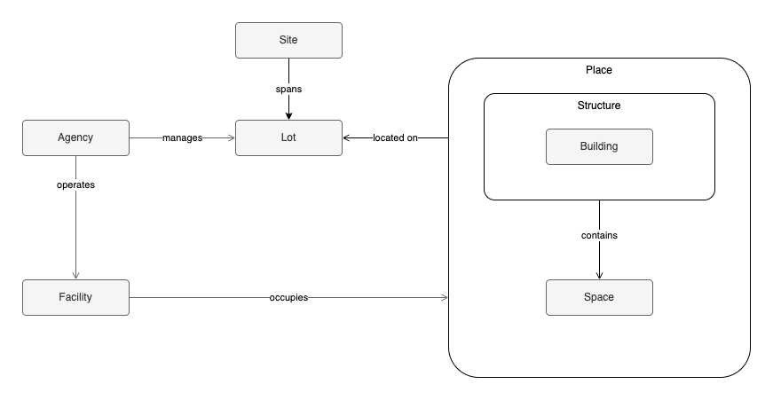

# Urban Planning Glossary

Terms and concepts related to the built environment and urban planning activities in New York City.

Organized as entities and their relationships in order to be a foundation for data modeling.

## Entities

**Lot**: A lot is a distinct parcel of land with a unique borough, block, and lot number (BBL).

**Place**: A place is a physical or legal thing that exists at a site — a structure, or a bounded section of one.

**Structure**: A structure is a built object that is permanently affixed to the land.

**Building**: A building is a structure that has a roof and one or more floors.

**Space**: A space is a section of a structure that is structurally or legally independent of other sections for the purposes of separate occupancy or use.

**Asset**: An asset is a tangible or intangible resource that is owned, leased, or operated by an entity.

**Capital Asset**: A capital asset is an asset that has a useful life of multiple years and a replacement value exceeding its owner's capitalization threshold.

**Site**: A site is an area of land associated with an actual or potential development, use, or activity.

**Facility**: A facility is one or more places that are used to provide or support operations or services.

**Agency**: An agency is a government office, department, board, commission, bureau, or affiliated non-profit which either administers public services, manages assets, or both.

## Relationships

The table and diagram cover some of the hierarchies and relationships between entities. Cardinality is left blank for `is a` rows — those are classifications, not associations. `located on` applies only to a Place that isn't already contained by another Place — e.g. a Structure sits directly on a Site, while a Space inside that Structure reaches the Site only transitively, through the Structure, via `contains`.

| Entity | Relationship | Cardinality | Entity |
|---|---|---|---|
| Structure | is a | | Place |
| Space | is a | | Place |
| Building | is a | | Structure |
| Site | spans | 1 : 1..N | Lot |
| Place | located on | 0..N : 1 | Site |
| Place | contains | 1 : 0..N | Place |
| Facility | occupies | 1 : 1..N | Place |
| Agency | manages | 1 : 0..N | Site |
| Agency | operates | 1 : 0..N | Facility |

## See also

Relevant external glossaries:

- [NYC Planning Glossary of Zoning Terms](https://www.nyc.gov/assets/planning/downloads/pdf/zoning/downloadable-zoning-resources/zoning-glossary.pdf) - brief explanations of planning and zoning terminology, including terms highlighted in the Zoning Handbook.
- [Zoning Resolution §12-00 Definitions](https://zr.planning.nyc.gov/article-i/chapter-2#12-00) — legal definitions of terms in the Zoning Resolution
