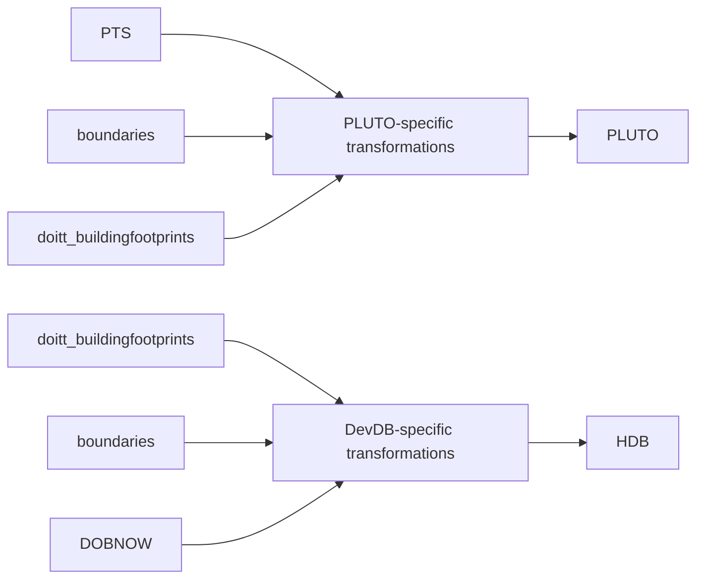
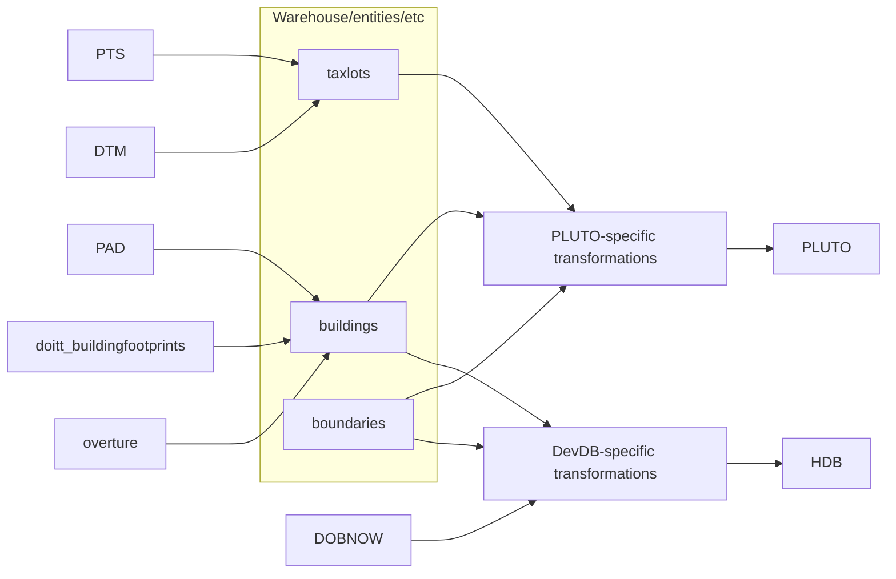

# Entities

The main rationale for this is moving towards a less fragmented approach to determining truth around entities in our data.

Our data flow for a build is very focused on inputs and outputs, and our logic and reasoning around what exists sort of start in the context of a build.

Both of these rely heavily on the notion of a "building", and despite building being a pretty concrete concept, it's a little abstract in both of these pipelines. How they might differ from one pipeline to the next also isn't immediately clear, and can end up in redundancies.

Long term, it would makes sense to move to something more like this

Part of the main focus of this is that then these entities are something that exist more in their own right, and that we treat as first-class data. Often, we discover issues with data at the end of a product build. So PLUTO is built, and then we need to start figuring out how weird data issues relate to upstream data inputs.

One approach to fix this is to enforce expectations on the data when we ingest it. We want to do some of this, but this is also a lift - we ingest 200+ datasets and don't really control their quality. But if we introduce these intermediate entities which have very real significance, both in our pipelines and the real world, and relate more closely to our expectations of the world, we might end up in an easier place to diagnose deviations from expectations for simple but fundamental entity tables before we even think about producing PLUTO, or HDB, etc.
