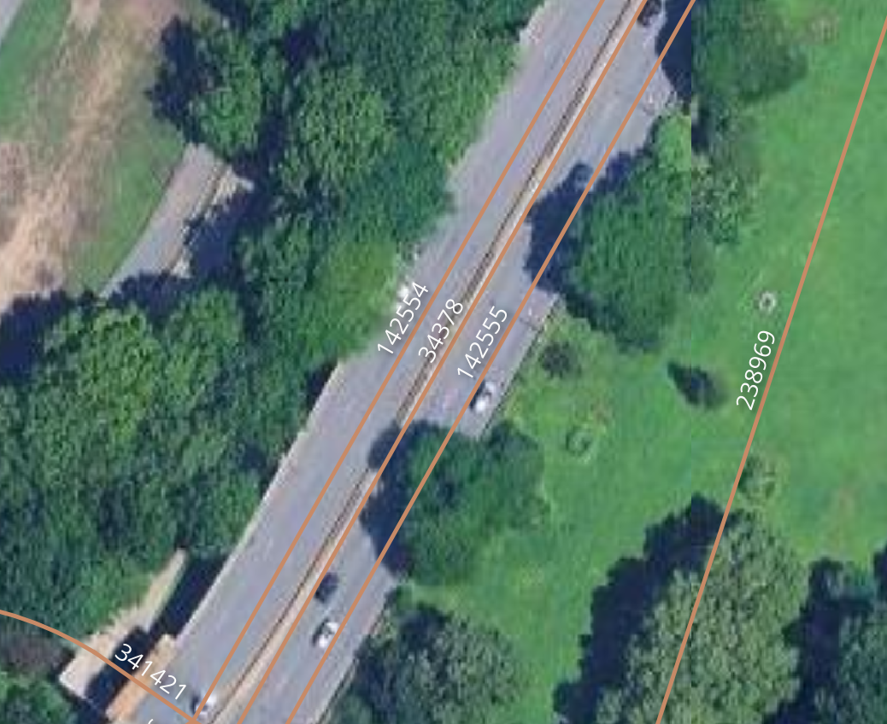

# Structure of docs

This document is organized by output file. Each of these has the following sections
- description/summary
- export format
- transformation logic
- error reporting

# Notes

## Formatting
There are many formatting rules for the various text outputs

### Justification and Fill
Probably self explanatory with just one-or two of these rows, but these are the possible values

| Format | Meaning | Example unformatted value | Formatted Value |
|-|-|-|-|
| RJSF | Right-justified, space-filled | 23 | `"  23"` |
| RJZF | Right-justified, zero-filled | 23 | `0023"` |
| LJSF | Left-justified, space-filled | 23 | `"23  "` |
| LJSF | Left-justified, zero-filled | 23 | `"2300"` |

### "Blank if none"
Not relevant for "space-filled" fields, but for zero-filled ones, a None value sometimes could be represented as `"0000"` or `"    "`. If a field is ZF but "blank if none", it would be the latter. This isn't relevant for a SF field because the result is the same either way.

### Census Tract Suffixes
[stub]

# Source Data
[stub]

# Outputs

## Geosupport LION

### Description/Summary

Every row is a: cscl segment

Often refered to as "LION flat files", "LION dat", "LION dat files". In some sense this is the core of this pipeline, and by far the most complex set of transformations. This consists of 5 specific files
- ManhattanLION.dat
- BronxLION.dat
- BrooklynLION.dat
- QueensLION.dat
- StatenIslandLION.dat
Which all stem from the same data/table but are obviously filtered by borough. There is significant overlap with "Bytes LION", which is a geodatabase

### Format
(copied from seeds/text_formatting/text_formatting__lion_dat.csv)

|field_number|field_name|field_label|field_length|start_index|end_index|justify_and_fill|blank_if_none|
|------------|----------|-----------|------------|-----------|---------|----------------|-------------|
|L1|boroughcode|Borough|1|1|1|RFSF|false|
|L2|face_code|Face Code|4|2|5|RJZF|false|
|L3|segment_seqnum|Sequence Number|5|6|10|RJZF|false|
|L4|segmentid|Segment ID|7|11|17|RJZF|false|
|L5|five_digit_street_code|5-Digit Street Code (5SC)|5|18|22|RJZF|false|
|L6|lgc1|LGC1|2|23|24|RJZF|false|
|L7|lgc2|LGC2|2|25|26|RJZF|true|
|L8|lgc3|LGC3|2|27|28|RJZF|true|
|L9|lgc4|LGC4|2|29|30|RJZF|true|
|L10|boe_lgc_pointer|Board of Elections LGC Pointer|1|31|31|RJSF|true|
|L11|from_sectionalmap|From-Sectional Map|2|32|33|RJZF|false|
|L12|from_nodeid|From-Node ID|7|34|40|RJZF|false|
|L13|from_x|From-X Coordinate|7|41|47|RJZF|false|
|L14|from_y|From-Y Coordinate|7|48|54|RJZF|false|
|L15|to_sectionalmap|To-Sectional Map|2|55|56|RJZF|false|
|L16|to_nodeid|To-Node ID|7|57|63|RJZF|false|
|L17|to_x|To-X Coordinate|7|64|70|RJZF|false|
|L18|to_y|To-Y Coordinate|7|71|77|RJZF|false|
|L19|left_2000_census_tract_basic|Left 2000 Census Tract Basic|4|78|81|RJSF|false|
|L19_1|left_2000_census_tract_suffix|Left 2000 Census Tract Suffix|2|82|83|RJZF|true|
|L20|left_dynamic_block|Left Dynamic Block|3|84|86|RJSF|false|
|L21|l_low_hn|Left Low House Number|7|87|93|RJSF|false|
|L22|l_high_hn|Left High House Number|7|94|100|RJSF|false|
|L23|lsubsect|Left Dept of Sanitation Subsection|2|101|102|RJZF|true|
|L24|l_zip|Left Zip Code|5|103|107|RJZF|true|
|L25|left_assembly_district|Left Assembly District|2|108|109|RJZF|true|
|L26|left_election_district|Left Election District|3|110|112|RJZF|true|
|L27|left_school_district|Left School District|2|113|114|RJZF|true|
|L28|right_2000_census_tract_basic|Right 2000 Census Tract Basic|4|115|118|RJSF|false|
|L28_1|right_2000_census_tract_suffix|Right 2000 Census Tract Suffix|2|119|120|RJZF|true|
|L29|right_dynamic_block|Right Dynamic Block|3|121|123|RJSF|false|
|L30|r_low_hn|Right Low House Number|7|124|130|RJSF|false|
|L31|r_high_hn|Right High House Number|7|131|137|RJSF|false|
|L32|rsubsect|Right Dept of Sanitation Subsection|2|138|139|RJZF|true|
|L33|r_zip|Right Zip Code|5|140|144|RJZF|true|
|L34|right_assembly_district|Right Assembly District|2|145|146|RJZF|true|
|L35|right_election_district|Right Election District|3|147|149|RJZF|true|
|L36|right_school_district|Right School District|2|150|151|RJZF|true|
|L37|split_election_district_flag|Split Election District Flag|1|152|152|RJSF|false|
|L38|filler_l38|Filler (formerly Split Community School District Flag)|1|153|153|RJSF|false|
|L39|sandist_ind|Sanitation District Boundary Indicator|1|154|154|RJSF|false|
|L40|traffic_direction|Traffic Direction|1|155|155|RJSF|false|
|L41|segment_locational_status|Segment Locational Status|1|156|156|RJSF|false|
|L42|feature_type_code|Feature Type Code|1|157|157|RJSF|false|
|L43|nonped|Non-Pedestrian Flag|1|158|158|RJSF|false|
|L44|continuous_parity_flag|Continuous Parity Indicator|1|159|159|RJSF|false|
|L45|filler_l45|Filler (formerly the Near BQ-Boundary Flag)|1|160|160|RJSF|false|
|L46|borough_boundary_indicator|Borough Boundary Indicator|1|161|161|RJSF|false|
|L47|twisted_parity_flag|Twisted Parity Flag|1|162|162|RJSF|false|
|L48|special_address_flag|Special Address Flag|1|163|163|RJSF|false|
|L49|curve_flag|Curve Flag|1|164|164|RJSF|false|
|L50|center_of_curvature_x|Center of Curvature X-Coordinate|7|165|171|RJZF|false|
|L51|center_of_curvature_y|Center of Curvature Y-Coordinate|7|172|178|RJZF|false|
|L52|segment_length_ft|Segment Length in Feet|5|179|183|RJZF|false|
|L53|from_level_code|From Level Code|1|184|184|RJSF|false|
|L54|to_level_code|To Level Code|1|185|185|RJSF|false|
|L55|trafdir_ver_flag|Traffic Direction Verification Flag|1|186|186|RJSF|false|
|L56|segment_type|Segment Type Code|1|187|187|RJSF|false|
|L57|coincident_seg_count|Coincident Segment Counter|1|188|188|RJSF|false|
|L58|incex_flag|Include/Exclude Flag|1|189|189|RJSF|false|
|L59|rw_type|Roadway Type|2|190|191|RJSF|false|
|L60|physicalid|PHYSICALID|7|192|198|RJZF|true|
|L61|genericid|GENERICID|7|199|205|RJZF|true|
|L62|nypdid|NYPDID|7|206|212|RJZF|true|
|L63|fdnyid|FDNYID|7|213|219|RJZF|true|
|L64|filler_l64|Filler (formerly Left BLOCKFACEID)|7|220|226|RJSF|false|
|L65|filler_l65|Filler (formerly Right BLOCKFACEID)|7|227|233|RJSF|false|
|L66|status|STATUS|1|234|234|RJSF|false|
|L67|streetwidth_min|STREETWIDTH_MIN|3|235|237|RJSF|false|
|L68|streetwidth_irr|STREETWIDTH_IRR|1|238|238|RJSF|false|
|L69_1|bike_lane_1|BIKELANE_1|1|239|239|RJSF|false|
|L70|fcc|FCC|2|240|241|RJSF|false|
|L71|right_of_way_type|Right of Way Type|1|242|242|RJSF|false|
|L72|left_2010_census_tract_basic|Left 2010 Census Tract Basic|4|243|246|RJSF|false|
|L72|left_2010_census_tract_suffix|Left 2010 Census Tract Suffix|2|247|248|RJZF|true|
|L73|right_2010_census_tract_basic|Right 2010 Census Tract Basic|4|249|252|RJSF|false|
|L73|right_2010_census_tract_suffix|Right 2010 Census Tract Suffix|2|253|254|RJZF|true|
|L74|lgc5|LGC5|2|255|256|RJZF|true|
|L75|lgc6|LGC6|2|257|258|RJZF|true|
|L76|lgc7|LGC7|2|259|260|RJZF|true|
|L77|lgc8|LGC8|2|261|262|RJZF|true|
|L78|lgc9|LGC9|2|263|264|RJZF|true|
|L79|legacy_segmentid|Legacy SEGMENTID|7|265|271|RJZF|true|
|L80|left_2000_census_block_basic|LEFT CENSUS BLOCK 2000 BASIC|4|272|275|RJSF|false|
|L81|left_2000_census_block_suffix|LEFT CENSUS BLOCK 2000 SUFFIX|1|276|276|RJSF|false|
|L82|right_2000_census_block_basic|RIGHT CENSUS BLOCK 2000 BASIC|4|277|280|RJSF|false|
|L83|right_2000_census_block_suffix|RIGHT CENSUS BLOCK 2000 SUFFIX|1|281|281|RJSF|false|
|L84|left_2010_census_block_basic|LEFT CENSUS BLOCK 2010 BASIC|4|282|285|RJSF|false|
|L85|left_2010_census_block_suffix|LEFT CENSUS BLOCK 2010 SUFFIX|1|286|286|RJSF|false|
|L86|right_2010_census_block_basic|RIGHT CENSUS BLOCK 2010 BASIC|4|287|290|RJSF|false|
|L87|right_2010_census_block_suffix|RIGHT CENSUS BLOCK 2010 SUFFIX|1|291|291|RJSF|false|
|L88|snow_priority|SNOW PRIORITY|1|292|292|RJSF|false|
|L69_2|bike_lane_2|BIKELANE_2|2|293|294|RJSF|false|
|L67_2|streetwidth_max|STREET WIDTH MAX|3|295|297|RJSF|false|
|L89|filler_l89|Filler L89|3|298|300|RJSF|false|
|L90|l_blockfaceid|Left BLOCKFACEID|10|301|310|RJZF|true|
|L91|r_blockfaceid|Right BLOCKFACEID|10|311|320|RJZF|true|
|L92|number_travel_lanes|NUMBER TRAVEL LANES|2|321|322|RJSF|false|
|L93|number_park_lanes|NUMBER PARK LANES|2|323|324|RJSF|false|
|L94|number_total_lanes|NUMBER TOTAL LANES|2|325|326|RJSF|false|
|L95|bike_traffic_direction|BIKE TRAFFIC DIR|2|327|328|RJSF|false|
|L96|posted_speed|POSTED SPEED|2|329|330|RJSF|false|
|L97|left_nypd_service_area|Left NYPD Service Area|1|331|331|RJSF|false|
|L98|right_nypd_service_area|Right NYPD Service Area|1|332|332|RJSF|false|
|L99|truck_route_type|Truck Route Type|1|333|333|RJSF|false|
|L100|left_2020_census_tract_basic|LEFT 2020 CENSUS TRACT Basic|4|334|337|RJSF|false|
|L100|left_2020_census_tract_suffix|LEFT 2020 CENSUS TRACT Suffix|2|338|339|RJZF|true|
|L101|right_2020_census_tract_basic|RIGHT 2020 CENSUS TRACT Basic|4|340|343|RJSF|false|
|L101|right_2020_census_tract_suffix|RIGHT 2020 CENSUS TRACT Suffix|2|344|345|RJZF|true|
|L102|left_2020_census_block_basic|LEFT CENSUS BLOCK 2020 BASIC|4|346|349|RJSF|false|
|L103|left_2020_census_block_suffix|LEFT CENSUS BLOCK 2020 SUFFIX|1|350|350|RJSF|false|
|L104|right_2020_census_block_basic|RIGHT CENSUS BLOCK 2020 BASIC|4|351|354|RJSF|false|
|L105|right_2020_census_block_suffix|RIGHT CENSUS BLOCK 2020 SUFFIX|1|355|355|RJSF|false|
|L199|filler_l199|Filler L199|45|356|400|RJSF|false|

### Transformation
The source segments for LION come from 6 different CSCL feature layers (though rail/subway are treated identically)
- centerline
- shoreline
- rail
- subway
- nonstreetfeature
- altsegmentdata (proto segments)

"Feature type" is a concept that occurs throughout this document and the codebase. This can mean a couple things at a few levels. Some of this logic is in `seeds/feature_type_codes.csv`, but some specific logic lives within sql files. Generally, you can think of "feature type" as EITHER the source table that the segment originates, or in the case of protosegments, what feature type code is already set in the CSCL system. So this "feature type" or "feature class" or "implicit feature class" (the latter in the case of protosegments) is inclusive of many "feature type codes" or "lion feature type codes".

Another way of thinking about it is that feature type here is more what CSCL (and the ETL) cares about, while downstream in LION, the feature type code is the more important concept. All `field`s in the "how to determine" column refer to fields from the relevant source feature class.

|feature type|LION feature type code|How to determine|description|
|------------|----------------------|----------------|-----------|
|centerline||No other centerline criteria met|Public street, bridge or tunnel that exists physically (or its generic geometry), other than Feature Type Code W|
|centerline|5|`status = '3'`|Paper street that is not also a boundary|
|centerline|6|`status = '2' AND rwjurisdiction = '3'`|Private street that exists physically|
|centerline|9|`status = '9'`|Paper street that coincides with a non-physical boundary|
|centerline|A|`rw_type = 10`|Alley|
|centerline|W|`trafdir = 'NV'` and any non-zero address field|Path, non-vehicular, addressable|
|centerline|F|`rw_type=14`|Ferry|
|centerline|C|`status = '2' AND rwjurisdiction = '5'`|Constructed|
|shoreline|2||Shoreline|
|rail_and_subway|1||Rail or subway|
|nonstreetfeatures|3|`linetype = 3`|Non-physical census block boundary|
|nonstreetfeatures|7|`linetype IN (1, 2, 6)`|Non-physical boundary other than census|
|nonstreetfeatures|8|`linetype IN (4, 5)`|Physical boundary such as cemetery wall|
|nonstreetfeatures|4|`linetype = 7`|Other non-street feature|

Note that "how to determine" is not relevant in case of protosegments, as these have LION feature type code already set when we begin processing

All of the source feature types have slightly differing methods of processing, but when possible, they are handled in parallel.

[A simplified diagram showing how the ETL operates]

[...]

Additionally, each source layer has some distinct logic

#### Centerline
Centerline segments represent centerlines of streets.
[stub]

#### Shoreline
Shoreline segments are exactly what they sound like.
[stub]

#### Rail/Subway
Rail and subway segments are exactly what they sound like. This includes both above-ground and subterranean rail.
[stub]

#### Non-Street Features
A somewhat confusingly named layer since shoreline, rail, and subway are not streets either. Specifically, features of this type can be
- Non-physical census block boundary
- Non-physical boundary other than census
- Physical boundary such as cemetery wall
- Other non-street feature

[stub]

### Error reporting
[stub]

## Special Address Files (SAF)

### Description/Summary

Every row is a: special address flag, which can correspond to one of a few entities

The Special Address File (SAF) contains address information for some street segments supplementary to the address information for the same segments contained in the LION file.

| Flag | Source | Corresponds to | Meaning | Output |
| - | - | - | - | - |
| A | altsegmentdata | segment | Alternative address ranges | ABCEGNPX |
| B | altsegmentdata | segment | Alternative street names | ABCEGNPX |
| C | altsegmentdata | segment | Special record for Ruby Street on Brooklyn-Queens border | ABCEGNPX |
| D | altsegmentdata | segment | Duplicate or overlapping address ranges on the same street | D |
| E | altsegmentdata | segment | Neighborhood name usable in place of street name in addresses | ABCEGNPX |
| G | commonplace | segment | Non-Addressable place name of complexes | ABCEGNPX |
| I | namedintersection | intersection | Contain intersection names | I |
| N | commonplace | segment | Non-Addressable placename | ABCEGNPX |
| O | altsegmentdata | segment | Contain out-of-sequence addresses and opposite-parity addresse | OV |
| P | altsegmentdata | segment | Addressable placename | ABCEGNPX |
| S | addresspoint | segment | Suffixed house number(s) occurring at an intersection | S |
| V | addresspoint | segment | Contain Vanity Addresses | OV |
| X | commonplace | segment | Non-Addressable Place name of constituent entities of complexes | ABCEGNPX |

For each of the listed outputs other than "I", there are both a "generic" and "roadbed" output, meaning 9 output files in total.

#### Generic vs Roadbed
Other than the interesction file, all output files have both a "generic" vs "roadbed" output. There are slightly more complicated rules on what exactly ends up in each (and how the "roadbed pointer list" is used), but the general difference corresponds to sections of divided roadway. See [segment lookup](#segment-lookup) for details on how this specifically determined.

A divided roadway is modeled in CSCL and LION as such
- One "generic" segment, which corresponds to the entire roadway, including all divided portions
- One "roadbed" segment PER DIVIDED SECTION of the roadway

All of these have their own distinct segmentids (and their own records in centerline feature layer as well as LION). Take this example of a stretch of the Hudson Parkway.

For the stretch of divided freeway in the center of the picture, we have 3 segments
- 34378 - the centerline segment for this whole stretch of road
- 142544 and 142545 - the roadbed segments for each of the individual divided roadbeds

The roadbed pointer list CSCL feature layer links roadbed segments to their respective generic segment. So in the above image, we would have two records, both with 34378 as the `generic_segmentid` and the respective roadbed segment id as the `roadbed_segmentid`, as well as various other fields (indicator of roadbed position, etc)

SAF outputs that correspond to segments (every output other than `I` - intersections) have both a Generic and Roadbed output. Most SAF records correspond to segments which are not divided streets, and end up in both outputs. Situations like the above screenshot, the respective output file will contain either only the generic SAF records or roadbed SAF records.

### Format
All output categories (collection of SAF types) have their own fields and formatting conventions.

`SAFA` formatting (for output files ABCEGNPX)

|fic|field_name|field_label|field_length|start_index|end_index|justify_and_fill|blank_if_none|
|---|----------|-----------|------------|-----------|---------|----------------|-------------|
|SAFA1|place_name|Special Address Street Name, Neighborhood Name or Place Name|32|1|32|LJSF|false|
|SAFA2|boroughcode|Borough|1|33|33|RJZF|false|
|SAFA3|face_code|Face Code|4|34|37|RJZF|false|
|SAFA4|segment_seqnum|Sequence Number|5|38|42|RJZF|false|
|SAFA5|sos_indicator|SOS Indicator|1|43|43|RJSF|false|
|SAFA6|b5sc|B5SC|6|44|49|RJSF|false|
|SAFA7|l_low_hn|Left Low HN|7|50|56|RJSF|false|
||filler_safa7|Filler|2|57|58|RJSF|false|
|SAFA8|l_high_hn|Left High HN|7|59|65|RJSF|false|
||filler_safa8|Filler|2|66|67|RJSF|false|
|SAFA9|r_low_hn|Right Low HN|7|68|74|RJSF|false|
||filler_safa9|Filler|2|75|76|RJSF|false|
|SAFA10|r_high_hn|Right High HN|7|77|83|RJSF|false|
||filler_safa10|Filler|2|84|85|RJSF|false|
|SAFA11|saftype|SAF Record Type Code|1|86|86|RJSF|false|
||filler_safa11|Filler|2|87|88|RJSF|false|
|SAFA12|lgc1|LGC1|2|89|90|RJZF|false|
|SAFA13|lgc2|LGC2|2|91|92|RJZF|true|
|SAFA14|lgc3|LGC3|2|93|94|RJZF|true|
|SAFA15|lgc4|LGC4|2|95|96|RJZF|true|
|SAFA16|boe_lgc_pointer|Pointer to BOE Preferred LGC|1|97|97|RJSF|false|
|SAFA17|segment_type|Segment Type Code|1|98|98|RJSF|false|
|SAFA18|segmentid|Segment ID|7|99|105|RJZF|false|
|SAFA19|x_coord|X Coordinate (GNX only)|7|106|112|RJZF|true|
|SAFA20|y_coord|Y Coordinate (GNX only)|7|113|119|RJZF|true|
|SAFA21|side_borough_code|Side borough code (GNX only)|1|120|120|RJZF|true|
|SAFA22_1|side_ct2020_basic|Side CT2020 Basic (GNX only) (XXXXYY)|4|121|124|RJSF|false|
|SAFA22_2|side_ct2020_suffix|Side CT2020 Suffix (GNX only) (XXXXYY)|2|125|126|RJZF|true|
|SAFA23|side_ap|Side AP (GNX only)|3|127|129|RJZF|true|

### Transformation

#### Segment Lookup
All flags other than `I` are associated with segments and must be joined to them. This logic occurs in `int__saf_segments`.

This isn't a simple join to a segment-based table, like a source feature layer, or `int__lion`, `int__segments`, etc primarily for two reasons
- A single SAF record can correspond to both roadbed and generic segments for certain SAF sources
- SAF records are linked to segment by segmentid, not lionkey, meaning protosegments need differentiating

In terms of handling roadbed vs generic:
- records from altsegmentdata are defined in CSCL for both the generic segments and roadbed segments already, separately. So for 1 generic segment with 3 roadbed segments, you might see 4 records in altsegmentdata, one for each individual segment. Put more simply, 1 record in altsegmentdata always corresponds to just one output record.
- records from addresspoint and commonplace (in the cases of split roadways) are only defined for the roadbed segments, but output records should be generated for the generic segments as well. So one source record in addresspoint or commonplace could generate multiple output records each.

On protosegments: a SAF record only corresponds to a protosegment rather than the geometry-modeled segment if
1. the geometry-modeled segment is a centerline segment
2. the protosegment is a borough boundary segment
3. the borough of the saf record matches the protosegment and not the geometry-modeled segment

Really, the third necesitates the second. So to implement both generic segment lookup and determining relevant protosegments in `int__saf_segments`, the query
1. finds all source records for SAF and unions them (keeping track by source feature layer and globalid)
2. for relevant records, joins to roadbed pointer list to link SAF records defined for roadbed segments to the generic segment
3. unions the above to the original set of records. At this point, we have the backbone for the SAF outputs downstream of this table, where 1 record here should be reflected 1-1 in an output file

Segment-associated saf records have logic applied to determine which output files (roadbed, generic, or both) they are exported to. This is determined as follows:

| Output file | `segment_type` of associated segment |
| - | - |
| Generic |  B, E, G (except when INCEX_FLAG = ‘E’), U |
| Roadbed | E, R, S, U |

#### "Sort Format"
Numbers in street or place names are formatted specially such that numbering of streets sorts correctly when sorted alphabetically. Numbers are left-padded with spaces to 4 characters. Additionally, spaces should be inserted between numbers and non-whitespace characters that immediately precede or follow them. There is one exception - if a number is immediately followed or preceded by a slash or dash, it is treated as "word" and not a number, and should not be formatted in any way. [TODO - this needs some clarification. The ETL docs seem to suggest that this applies to all "sort format" processing, but it seems like there are cases where this doesn't apply in the production outputs. Not sure if requirement or bug]

| Input string | Output string |
| - | - |
| `3 AVENUE` | `   3 AVENUE` |
| `11 AVENUE` | `  11 AVENUE` |
| `108 STREET` | ` 108 STREET` |
| `EAST 7 STREET` | `EAST    7 STREET` |
| `EAST 23 STREET` | `EAST   23 STREET` |
| `EAST 104 STREET` | `EAST  104 STREET` |
| `EAST 9 STREET BLDG16` | `EAST    9 STREET BLDG   16` |
| `9/11 MEMORIAL PLAZA` | `9/11 MEMORIAL PLAZA` |

Note the additional spaces between `BLDG` and `16` - the 16 is both left-padded to four characters and a space is added, meaning there are three spaces separating the word and the number

This formatting occurs in a staging table not exclusive to saf - `stg__featurename_and_facecode`.

#### House Numbers
House numbers come from the AddressPoint CSCL feature layer. They have multiple fields and come with some special formatting rules. This logic is currently handled in `int__address_points`.

- Edgewater Park
  - AddressPoints are joined to the StreetName table on b7sc (and StreetName.principal_flag = 'Y'). If the street name entry has snd_feature_type (SND = Street Name Dictionary) in 'E' or 'F' and the address point has a house number suffix, this record is in Edgewater Park in the Bronx and needs special logic applied. 
  - For the `house_number` field, the relevant records will have a `house_number_suffix` field ending with a capital letter, `A` through `E`. These should be converted to a number (1-5), multiplied by 10,000, and added to the house number of the record.
  - For the `house_number_suffix` field, if the suffix contains a hyphen, only the part before the hyphen should be kept.
- AddressPoint `hyphen_type` = 'R'
  - NOTE - seems that docs might be out of date and this is no longer relevant. It's still implemented, in a way that whether or not the fields are formatted this way, the correct logic will be applied.
  - Before, this implied that the `house_number` field was a range (`'22-28'` or `'22 - 28'`). Only the value before then hyphen (trimmed of whitespace) should be kept.
  - Now, it seems that when `hyphen_type` is R, the `house_number` field already only contains the lowest value, and the ``house_number`_range` field contains the high end of the range.

#### ABCEP Records
A, B, C, E, and P records correspond to segments which
- A: have alternative address ranges
- B: have alternative street names
- C: are on [Ruby Street](https://nycplanning.github.io/Geosupport-UPG/chapters/chapterV/section08/) on the Brooklyn-Queens border (hard-coded flag)
- E: have a neighborhood name usable in place of street name in addresses
- P: have an addressable placename (like "Empire State Building")

They are generated from all saf altsegmentdata records with saftype A, B, C, E, or P.

Starting from `int__saf_segments`, ABCEP records are joined to
- altsegmentdata to lookup primary tabular data for the saf record
- `stg__facecode_and_featurename_principal` (essentially StreetName and FeatureName CSCL feature layers unioned) to lookup street/feature name by b7sc

Most fields are taken directly from the SAF (altsegmentdata) record itself or the associated segment

| FIC | Field | Source of Data |
| - | - | - |
| SAFA1 | Special Address Street Name or Neighborhood Name or Addressable Place Name | Except for type C records, obtained from featurename table, in sort format.  For type C records, populate with the value ’75 STREET’. 
| SAFA2 | Borough | AltSegmentData field `boroughcode` |
| SAFA3 | Face Code | Obtained from bytes 2 through 5 of AltSegmentData `lionkey` field  |
| SAFA4 | Sequence Number | Obtained from bytes 6 through 10 of AltSegmentData `lionkey` field |
| SAFA5 | SOS Indicator | AltSegmentData field `sosindicator`, mapped `1` -> `L`, `2` -> `R` |
| SAFA6 | B5SC | AltSegmentData field `b5sc` |
| SAFA7 | Left Low HN | AltSegmentData field `l_low_hn` |
| SAFA8 | Left High HN | AltSegmentData field `l_high_hn` |
| SAFA9 | Right Low HN | AltSegmentData field `r_low_hn` |
| SAFA10 | Right High HN | AltSegmentData field `r_high_hn` |
| SAFA11 | SAF Record Type Code | AltSegmentData field `saftype` |
| SAFA12 | LGC1 | AltSegmentData field `lgc1` |
| SAFA13 | LGC2 | AltSegmentData field `lgc2` |
| SAFA14 | LGC3 | AltSegmentData field `lgc3` |
| SAFA15 | LGC4 | AltSegmentData field `lgc4` |
| SAFA16 | Pointer to BOE Preferred LGC | AltSegmentData field `boe_preferred_lgc_flac` |
| SAFA17 | Segment Type Code | `segment_type` of associated segment |
| SAFA18 | Segment ID | AltSegmentData field `segmentid` |
| N/A | 14-byte filler | Nulls for fields in GNX but not ABCEP |

Notes:
- SAFA1
  - if a feature name is found rather than a street name, a warning should be issued
  - if no street/feature name is found, an error should be issued and no result record produced

#### GNX Records
G, N, and X records are all [non-addressable place names](https://nycplanning.github.io/Geosupport-UPG/chapters/chapterIV/section07/)
- G: Non-addressable place names of complexes
- N: Non-addressable place names (not G or X)
- X: Non-Addressable place names of constituent entities of complexes

They are generated from all commonplace records with 
- saftype G, N, or X
- non-blank/null b7sc
- security_level not equal to `'3'` (corresponding to a public safety agency)

Starting from `int__saf_segments`, GNX records are joined to
- commonplace to lookup primary tabular data for the saf record
- `stg__facecode_and_featurename_principal` (essentially StreetName and FeatureName CSCL feature layers unioned) to lookup street/feature name by b7sc
- `int__address_points`, largely the AddressPoint feature layer with some cleaning/processing done of the house number fields
- `stg__atomic_polygons`, a spatial join from commonplace point to the atomic polygon which contains it

Fields are determined as follows

| FIC | Field | CSCL Source of Data |
| - | - | - |
| SAFA1 | Place Name | Obtained from FeatureName table |
| SAFA2 | Borough | CommonPlace attribute `boroughcode` |
| SAFA3 | Face Code | Segment `face_code` |
| SAFA4 | Sequence Number | Segment `segment_seqnum` |
| SAFA5 | SOS Indicator | CommonPlace attribute `sosindicator`, mapped `1` -> `L`, `2` -> `R` |
| SAFA6 | B5SC of NAP | First 6 bytes of CommonPlace attribute `b7sc` |
| SAFA7 | Left Low HN | `'0'` |
| SAFA8 | Left High HN | AddressPoint formatted housenumber if `sosindicator` = 1 |
| SAFA9 | Right Low HN | `'0'` |
| SAFA10 | Right High HN | AddressPoint formatted housenumber if `sosindicator` = 2 |
| SAFA11 | SAF Record Type Code | CommonPlace attribute `saftype` |
| SAFA12 | LGC1 of NAP | Last two characters of CommonPlace attribute `b7sc` |
| SAFA13 | LGC2 of NAP | Null |
| SAFA14 | LGC3 of NAP | Null |
| SAFA15 | LGC4 of NAP | Null |
| SAFA16 | Pointer to BOE Preferred LGC | ‘1’ |
| SAFA17 | Segment Type Code | `segment_type` of associated segment |
| SAFA18 | Segment ID | AltSegmentData field `segmentid` |
| SAFA19 | X Coordinate of Place | X coordinate of CommonPlace point |
| SAFA20 | Y Coordinate of Place | Y coordinate of CommonPlace point |
| SAFA21 | Side borough code | AtomicPolygon `boroughcode` |
| SAFA22 | Side CT2020 (XXXXYY) | AtomicPolygon ct 2020 basic and suffix |
| SAFA23 | Side AP | AtomicPolygon dynamic block (last three characters of `atomicid`) |

Notes
- if no street/feature name is found, an error should be issued

# Infrastructure
[stub]
