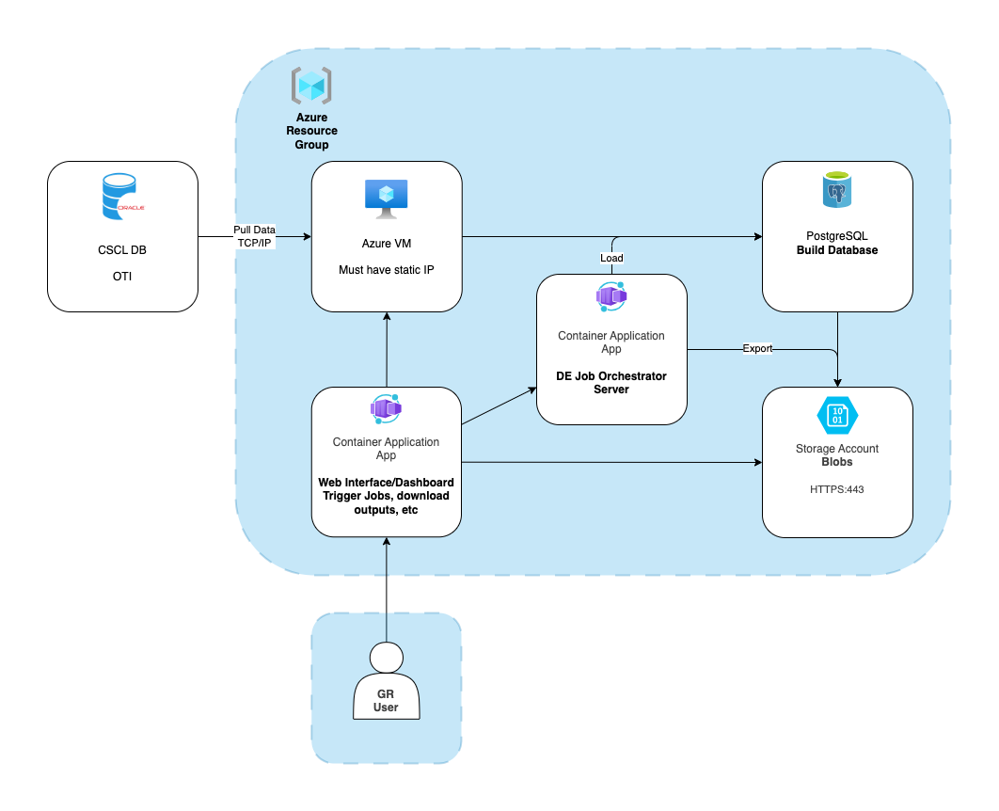
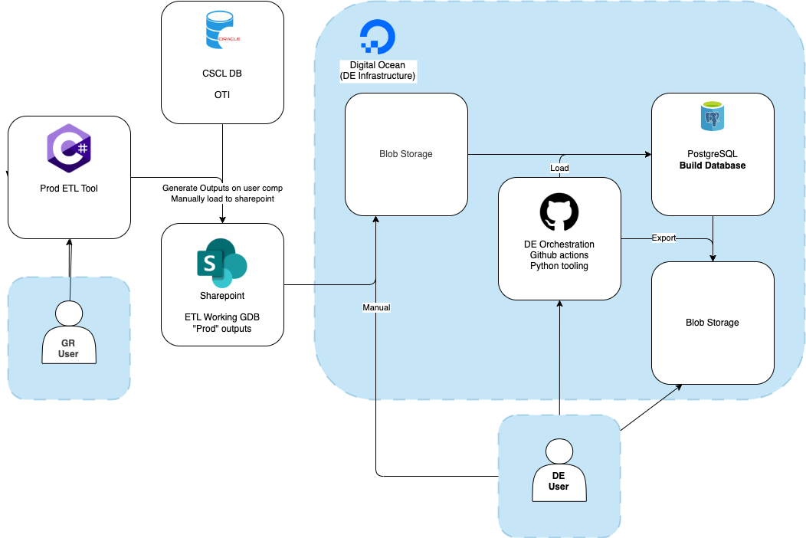
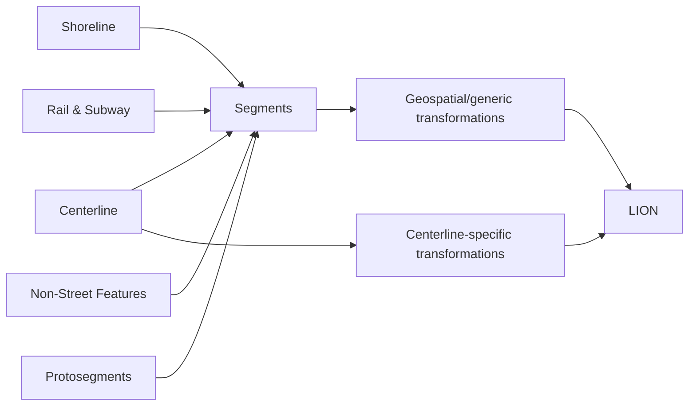

# Introduction
The Citywide Street Centerline (CSCL) system is a complex collection of data and infrastructure. Primarily, it is a large collection of core/primary (and official) geospatial data of NYC as well as key tabular data relating to streets, addresses, and other features. It includes (but not limited to) street centerlines, rail and subway lines, administrative boundaries, and a variety of address-based data. The data lives in an Oracle database maintained by the Office of Technology and Innovation (OTI), while the data themselves are maintained by DCP staff members, the Geographic Research (GR) team. GR uses a complex, custom-built ArcMap (one day to be ArcPro) plugin to edit and make edits to CSCL data with ArcMap communicating directly with the database and the plugin applying many custom business rules to ensure topology between different source layers, allow custom operations, etc.

The [Geosupport System](https://www.nyc.gov/assets/planning/download/pdf/data-maps/open-data/upg.pdf) (or just "Geosupport"/"GeoSupport") is an integrated system of software and data files that processes New York City geographic locations. Input locations can be accepted in various forms, including addresses, place names, street intersections, blockfaces, street stretches and property parcels (tax lots). Geosupport standardizes and validates the input location and provides related geographic information, such as the community district, census tract and census block, ZIP code, tax block and tax lot, police precinct, cross streets, City Council district and spatial coordinates.Geosupport was developed and is maintained by the Geographic Systems Section (GSS) of DCP.

The files that underly GeoSupport are based on CSCL. This pipeline

- extracts data from the OTI-maintained CSCL database and loads it into a DCP-maintained postgres database
- transforms the data as specified by specific business rules
- exports a variety of files, chiefly
  - the files that underly GeoSupport (LION, lookup tables, etc)
  - file geodatabases that are published to the public

This pipeline and its architecture are developed and maintained by DCP's Data Engineering team (DE).

It's primary users are GR, who are the owners of CSCL data run this pipeline operationally, and GSS, who are the consumers, domain experts, and business owners of its outputs.

# Architecture
This project is in progress, and the architecture may change.

The pipeline will broadly use Data Engineering's standard infrastructure, when possible. This includes:

- Postgres database (hosted in Digital Ocean now, Azure in the future) where transformations occur
- On-demand compute to move/load files/data, trigger build on database (Github Actions now, Azure Container Apps in the future)
- Blob storage (again, Digital Ocean now, Azure in the future) where output files are exported from the database to
- Some sort of web dashboard like streamlit (hosted on some Digital Ocean or Azure compute) for users to interact with the pipeline, download exports, etc

For the sake of brevity, diagrams purely with regards to DE infrastructure are not included, but the Data Engineering team can provide if needed. This pipeline requires some slightly custom infrastructure, mainly due to the limitations of accessing the source data, the CSCL database. The overall architecture for the pipeline must eventually resemble something like this:

The source data lives on an Oracle database maintained and running at OTI. This must be pulled by a computer/vm with a static IP address on CityNet, whitelisted by OTI for accessing CSCL. In the C# ETL application, GR user's computers meet this requirement. Since the new pipeline will be running on compute (and database) in the cloud rather than on users' PCs, there will need to be a dedicated compute with a whitelisted static IP.

There will also be a web interface for GR users to interact with the pipeline from, akin to the current dashboard maintained by DE that GR uses to trigger custom GeoSupport QA TODO LINK THIS. They will need to specify a source schema in the CSCL database and trigger extraction and transfortion, as well as download or otherwise interact with the outputs of the pipeline.

Beyond that, things largely follow DE's standard - on-demand compute (in this case triggered from GR's web UI) which runs an ELT process and exports files to blob storage.

Currently, the in-progress pipeline (as of Feb 27, 2026) looks more like this:

With 3 key differences:

- The extraction from the CSCL database is not performed by DE infrastructure/tooling yet
- There is no UI for GR to interact with the pipeline
- DE infrastructure is still in Azure and orchestrated by Github Actions

# User Interface
As mentioned, while Data Engineering is the maintainer of this pipeline, its architecture, and its transformations, we are not the primary users of this pipeline. To that end, a user interface ~~has been~~ will be designed so that users in GR/GSS can:

- extract data from a target schema in the CSCL database
- run this pipeline on extracted data of their choosing
- download with or otherwise interact with outputs of this pipeline
- (as a potential enhancement) visualize results/statistics of pipelines that have run

Requirements for this interface are not fully flushed out, nor is the design. This document will be updated accordingly as the project progresses.

# Transformation

This section is largely organized by output file. Each of these has the following sections

- description/summary
- export format
- transformation logic
- error reporting

## General Notes
For glossary/foundational concepts, see [Appendix A](#appendix-a-conceptsterminology)

### Formatting
There are many formatting rules for the various text outputs

#### Justification and Fill
Probably self explanatory with just one-or two of these rows, but these are the possible values

| Format | Meaning | Example unformatted value | Formatted Value |
|-|-|-|-|
| RJSF | Right-justified, space-filled | 23 | `"  23"` |
| RJZF | Right-justified, zero-filled | 23 | `0023"` |
| LJSF | Left-justified, space-filled | 23 | `"23  "` |
| LJSF | Left-justified, zero-filled | 23 | `"2300"` |

: Field Justification and Fill Format Code. {#tbl:field-format-jf}

#### "Blank if none"
Not relevant for "space-filled" fields, but for zero-filled ones, a None value sometimes could be represented as `"0000"` or `"    "`. If a field is ZF but "blank if none", it would be the latter. This isn't relevant for a SF field because the result is the same either way.

#### Census Tract Suffixes
Tracts are a total of six characters in length.  They consist of two subfields: a “basic tract number” subfield of four characters followed by a “tract suffix” subfield of two characters.  Symbolically, this format can be expressed as BBBBSS, where BBBB is the four-byte basic tract number field and SS is the two-byte tract suffix subfield. However, they come in from CSCL as a single 6-digit number. For example:

- 000100 -> basic is '1', suffix is null
- 000101 -> basic is '1', suffix is '1'

In processing, these should be split into basic and suffix, and have the following steps taken:

- The basic tract number value is treated as an int in the pipeline, then formatted RJSF for export.   
- The suffix value is treated as an int, converted to null if zero, and then formatted RJZF but blank if none for export.

Since these are exported as text as successive fields, they should look something like this on export:

- `"107201"`	(basic number is 1072, suffix is 01) 
- `"  5604"`	(basic number is 56, suffix is 04)
- `"  87  "`	(basic number is 87, no suffix) 

## Geosupport LION

Every row is a: cscl segment

Output files are densely-formatted text.

Often refered to as "LION flat files", "LION dat", "LION dat files". In some sense this is the core of this pipeline, and by far the most complex set of transformations. This consists of 5 specific files

- ManhattanLION.dat
- BronxLION.dat
- BrooklynLION.dat
- QueensLION.dat
- StatenIslandLION.dat

Which all stem from the same data/table but are obviously filtered by borough. There is significant overlap with "Bytes LION", which is a geodatabase

### Format
(copied from seeds/text_formatting/text_formatting__lion_dat.csv. Ideally, this should be an embedded table - seems like that's not supported out-of-the-box in pandoc)

|field_number|field_name|field_label|field_length|start_index|end_index|justify_and_fill|blank_if_none|
|------------|----------|-----------|------------|-----------|---------|----------------|-------------|
|L1|boroughcode|Borough|1|1|1|RFSF|false|
|L2|face_code|Face Code|4|2|5|RJZF|false|
|L3|segment_seqnum|Sequence Number|5|6|10|RJZF|false|
|L4|segmentid|Segment ID|7|11|17|RJZF|false|
|L5|five_digit_street_code|5-Digit Street Code (5SC)|5|18|22|RJZF|false|
|L6|lgc1|LGC1|2|23|24|RJZF|false|
|L7|lgc2|LGC2|2|25|26|RJZF|true|
|L8|lgc3|LGC3|2|27|28|RJZF|true|
|L9|lgc4|LGC4|2|29|30|RJZF|true|
|L10|boe_lgc_pointer|Board of Elections LGC Pointer|1|31|31|RJSF|true|
|L11|from_sectionalmap|From-Sectional Map|2|32|33|RJZF|false|
|L12|from_nodeid|From-Node ID|7|34|40|RJZF|false|
|L13|from_x|From-X Coordinate|7|41|47|RJZF|false|
|L14|from_y|From-Y Coordinate|7|48|54|RJZF|false|
|L15|to_sectionalmap|To-Sectional Map|2|55|56|RJZF|false|
|L16|to_nodeid|To-Node ID|7|57|63|RJZF|false|
|L17|to_x|To-X Coordinate|7|64|70|RJZF|false|
|L18|to_y|To-Y Coordinate|7|71|77|RJZF|false|
|L19|left_2000_census_tract_basic|Left 2000 Census Tract Basic|4|78|81|RJSF|false|
|L19_1|left_2000_census_tract_suffix|Left 2000 Census Tract Suffix|2|82|83|RJZF|true|
|L20|left_dynamic_block|Left Dynamic Block|3|84|86|RJSF|false|
|L21|l_low_hn|Left Low House Number|7|87|93|RJSF|false|
|L22|l_high_hn|Left High House Number|7|94|100|RJSF|false|
|L23|lsubsect|Left Dept of Sanitation Subsection|2|101|102|RJZF|true|
|L24|l_zip|Left Zip Code|5|103|107|RJZF|true|
|L25|left_assembly_district|Left Assembly District|2|108|109|RJZF|true|
|L26|left_election_district|Left Election District|3|110|112|RJZF|true|
|L27|left_school_district|Left School District|2|113|114|RJZF|true|
|L28|right_2000_census_tract_basic|Right 2000 Census Tract Basic|4|115|118|RJSF|false|
|L28_1|right_2000_census_tract_suffix|Right 2000 Census Tract Suffix|2|119|120|RJZF|true|
|L29|right_dynamic_block|Right Dynamic Block|3|121|123|RJSF|false|
|L30|r_low_hn|Right Low House Number|7|124|130|RJSF|false|
|L31|r_high_hn|Right High House Number|7|131|137|RJSF|false|
|L32|rsubsect|Right Dept of Sanitation Subsection|2|138|139|RJZF|true|
|L33|r_zip|Right Zip Code|5|140|144|RJZF|true|
|L34|right_assembly_district|Right Assembly District|2|145|146|RJZF|true|
|L35|right_election_district|Right Election District|3|147|149|RJZF|true|
|L36|right_school_district|Right School District|2|150|151|RJZF|true|
|L37|split_election_district_flag|Split Election District Flag|1|152|152|RJSF|false|
|L38|filler_l38|Filler (formerly Split Community School District Flag)|1|153|153|RJSF|false|
|L39|sandist_ind|Sanitation District Boundary Indicator|1|154|154|RJSF|false|
|L40|traffic_direction|Traffic Direction|1|155|155|RJSF|false|
|L41|segment_locational_status|Segment Locational Status|1|156|156|RJSF|false|
|L42|feature_type_code|Feature Type Code|1|157|157|RJSF|false|
|L43|nonped|Non-Pedestrian Flag|1|158|158|RJSF|false|
|L44|continuous_parity_flag|Continuous Parity Indicator|1|159|159|RJSF|false|
|L45|filler_l45|Filler (formerly the Near BQ-Boundary Flag)|1|160|160|RJSF|false|
|L46|borough_boundary_indicator|Borough Boundary Indicator|1|161|161|RJSF|false|
|L47|twisted_parity_flag|Twisted Parity Flag|1|162|162|RJSF|false|
|L48|special_address_flag|Special Address Flag|1|163|163|RJSF|false|
|L49|curve_flag|Curve Flag|1|164|164|RJSF|false|
|L50|center_of_curvature_x|Center of Curvature X-Coordinate|7|165|171|RJZF|false|
|L51|center_of_curvature_y|Center of Curvature Y-Coordinate|7|172|178|RJZF|false|
|L52|segment_length_ft|Segment Length in Feet|5|179|183|RJZF|false|
|L53|from_level_code|From Level Code|1|184|184|RJSF|false|
|L54|to_level_code|To Level Code|1|185|185|RJSF|false|
|L55|trafdir_ver_flag|Traffic Direction Verification Flag|1|186|186|RJSF|false|
|L56|segment_type|Segment Type Code|1|187|187|RJSF|false|
|L57|coincident_seg_count|Coincident Segment Counter|1|188|188|RJSF|false|
|L58|incex_flag|Include/Exclude Flag|1|189|189|RJSF|false|
|L59|rw_type|Roadway Type|2|190|191|RJSF|false|
|L60|physicalid|PHYSICALID|7|192|198|RJZF|true|
|L61|genericid|GENERICID|7|199|205|RJZF|true|
|L62|nypdid|NYPDID|7|206|212|RJZF|true|
|L63|fdnyid|FDNYID|7|213|219|RJZF|true|
|L64|filler_l64|Filler (formerly Left BLOCKFACEID)|7|220|226|RJSF|false|
|L65|filler_l65|Filler (formerly Right BLOCKFACEID)|7|227|233|RJSF|false|
|L66|status|STATUS|1|234|234|RJSF|false|
|L67|streetwidth_min|STREETWIDTH_MIN|3|235|237|RJSF|false|
|L68|streetwidth_irr|STREETWIDTH_IRR|1|238|238|RJSF|false|
|L69_1|bike_lane_1|BIKELANE_1|1|239|239|RJSF|false|
|L70|fcc|FCC|2|240|241|RJSF|false|
|L71|right_of_way_type|Right of Way Type|1|242|242|RJSF|false|
|L72|left_2010_census_tract_basic|Left 2010 Census Tract Basic|4|243|246|RJSF|false|
|L72|left_2010_census_tract_suffix|Left 2010 Census Tract Suffix|2|247|248|RJZF|true|
|L73|right_2010_census_tract_basic|Right 2010 Census Tract Basic|4|249|252|RJSF|false|
|L73|right_2010_census_tract_suffix|Right 2010 Census Tract Suffix|2|253|254|RJZF|true|
|L74|lgc5|LGC5|2|255|256|RJZF|true|
|L75|lgc6|LGC6|2|257|258|RJZF|true|
|L76|lgc7|LGC7|2|259|260|RJZF|true|
|L77|lgc8|LGC8|2|261|262|RJZF|true|
|L78|lgc9|LGC9|2|263|264|RJZF|true|
|L79|legacy_segmentid|Legacy SEGMENTID|7|265|271|RJZF|true|
|L80|left_2000_census_block_basic|LEFT CENSUS BLOCK 2000 BASIC|4|272|275|RJSF|false|
|L81|left_2000_census_block_suffix|LEFT CENSUS BLOCK 2000 SUFFIX|1|276|276|RJSF|false|
|L82|right_2000_census_block_basic|RIGHT CENSUS BLOCK 2000 BASIC|4|277|280|RJSF|false|
|L83|right_2000_census_block_suffix|RIGHT CENSUS BLOCK 2000 SUFFIX|1|281|281|RJSF|false|
|L84|left_2010_census_block_basic|LEFT CENSUS BLOCK 2010 BASIC|4|282|285|RJSF|false|
|L85|left_2010_census_block_suffix|LEFT CENSUS BLOCK 2010 SUFFIX|1|286|286|RJSF|false|
|L86|right_2010_census_block_basic|RIGHT CENSUS BLOCK 2010 BASIC|4|287|290|RJSF|false|
|L87|right_2010_census_block_suffix|RIGHT CENSUS BLOCK 2010 SUFFIX|1|291|291|RJSF|false|
|L88|snow_priority|SNOW PRIORITY|1|292|292|RJSF|false|
|L69_2|bike_lane_2|BIKELANE_2|2|293|294|RJSF|false|
|L67_2|streetwidth_max|STREET WIDTH MAX|3|295|297|RJSF|false|
|L89|filler_l89|Filler L89|3|298|300|RJSF|false|
|L90|l_blockfaceid|Left BLOCKFACEID|10|301|310|RJZF|true|
|L91|r_blockfaceid|Right BLOCKFACEID|10|311|320|RJZF|true|
|L92|number_travel_lanes|NUMBER TRAVEL LANES|2|321|322|RJSF|false|
|L93|number_park_lanes|NUMBER PARK LANES|2|323|324|RJSF|false|
|L94|number_total_lanes|NUMBER TOTAL LANES|2|325|326|RJSF|false|
|L95|bike_traffic_direction|BIKE TRAFFIC DIR|2|327|328|RJSF|false|
|L96|posted_speed|POSTED SPEED|2|329|330|RJSF|false|
|L97|left_nypd_service_area|Left NYPD Service Area|1|331|331|RJSF|false|
|L98|right_nypd_service_area|Right NYPD Service Area|1|332|332|RJSF|false|
|L99|truck_route_type|Truck Route Type|1|333|333|RJSF|false|
|L100|left_2020_census_tract_basic|LEFT 2020 CENSUS TRACT Basic|4|334|337|RJSF|false|
|L100|left_2020_census_tract_suffix|LEFT 2020 CENSUS TRACT Suffix|2|338|339|RJZF|true|
|L101|right_2020_census_tract_basic|RIGHT 2020 CENSUS TRACT Basic|4|340|343|RJSF|false|
|L101|right_2020_census_tract_suffix|RIGHT 2020 CENSUS TRACT Suffix|2|344|345|RJZF|true|
|L102|left_2020_census_block_basic|LEFT CENSUS BLOCK 2020 BASIC|4|346|349|RJSF|false|
|L103|left_2020_census_block_suffix|LEFT CENSUS BLOCK 2020 SUFFIX|1|350|350|RJSF|false|
|L104|right_2020_census_block_basic|RIGHT CENSUS BLOCK 2020 BASIC|4|351|354|RJSF|false|
|L105|right_2020_census_block_suffix|RIGHT CENSUS BLOCK 2020 SUFFIX|1|355|355|RJSF|false|
|L199|filler_l199|Filler L199|45|356|400|RJSF|false|

: Geosupport LION field formatting. {#tbl:lion-geosupport-formatting}

### Transformation
The source segments for LION come from 6 different CSCL feature layers (though rail/subway are treated identically):

- centerline
- shoreline
- rail
- subway
- nonstreetfeature
- altsegmentdata (proto segments)

"Feature type" is a concept that occurs throughout this document and the codebase. This can mean a couple things at a few levels. Some of this logic is in `seeds/feature_type_codes.csv`, but some specific logic lives within sql files. Generally, you can think of "feature type" as EITHER the source table that the segment originates, or in the case of protosegments, what feature type code is already set in the CSCL system. So this "feature type" or "feature class" or "implicit feature class" (the latter in the case of protosegments) is inclusive of many "feature type codes" or "lion feature type codes".

Another way of thinking about it is that feature type here is more what CSCL (and the ETL) cares about, while downstream in LION, the feature type code is the more important concept. All `field`s in the "how to determine" column refer to fields from the relevant source feature class. This table shows the meaning but also shows how L42 is set

|feature type|LION feature type code|How to determine|description|
|------------|----------------------|----------------|-----------|
|centerline||No other centerline criteria met|Public street, bridge or tunnel that exists physically (or its generic geometry), other than Feature Type Code W|
|centerline|5|`status = '3'`|Paper street that is not also a boundary|
|centerline|6|`status = '2' AND rwjurisdiction = '3'`|Private street that exists physically|
|centerline|9|`status = '9'`|Paper street that coincides with a non-physical boundary|
|centerline|A|`rw_type = 10`|Alley|
|centerline|W|`trafdir = 'NV'` and any non-zero address field|Path, non-vehicular, addressable|
|centerline|F|`rw_type=14`|Ferry|
|centerline|C|`status = '2' AND rwjurisdiction = '5'`|Constructed|
|shoreline|2||Shoreline|
|rail_and_subway|1||Rail or subway|
|nonstreetfeatures|3|`linetype = 3`|Non-physical census block boundary|
|nonstreetfeatures|7|`linetype IN (1, 2, 6)`|Non-physical boundary other than census|
|nonstreetfeatures|8|`linetype IN (4, 5)`|Physical boundary such as cemetery wall|
|nonstreetfeatures|4|`linetype = 7`|Other non-street feature|

: LION and CSCL linear feature types. {#tbl:linear-feature-types}

Note that "how to determine" is not relevant in case of protosegments, as these have LION feature type code already set when we begin processing

All of the source feature types have slightly differing methods of processing, but when possible, they are handled in parallel, that is, all segments are unioned/concatenated to be in one intermediate table `int__segments`, and each operation - join to atomic polygons, etc - is handled at the same time for all records.

Transformations specific to source layers other than centerline omitted for brevity.

The below table has a summary of the sources of each field in Geosupport LION. When a specific source layer is mentioned as a source (as in "Centerline field L_LOW_HN"), this means that for non-centerline segments the value is null.

| FIC | Field | Populating Method |
|-----|-------|-------------------|
| L1 | Borough | Centerline attribute BOROUGHCODE, otherwise from [LGC lookup](#street-code-and-face-code) |
| L2 | Face Code | See [Street Code and Face Code](#street-code-and-face-code) |
| L3 | Sequence Number |  |
| L4 | Segment ID | Source layer field SEGMENTID |
| L5 | 5-Digit Street Code (5SC) | See [Street Code and Face Code](#street-code-and-face-code) |
| L6 | LGC1 | See [Street Code and Face Code](#street-code-and-face-code) |
| L7 | LGC2 | See [Street Code and Face Code](#street-code-and-face-code) |
| L8 | LGC3 | See [Street Code and Face Code](#street-code-and-face-code) |
| L9 | LGC4 | See [Street Code and Face Code](#street-code-and-face-code) |
| L10 | Board of Elections LGC Pointer | See [Street Code and Face Code](#street-code-and-face-code) |
| L11 | From-Sectional Map | See [Nodes](#node-related-items)|
| L12 | From-Node ID | See [Nodes](#node-related-items) |
| L13 | From-X Coordinate | Feature geometry |
| L14 | From-Y Coordinate | Feature geometry |
| L15 | To-Sectional Map | See [Nodes](#node-related-items) |
| L16 | To-Node ID | See [Nodes](#node-related-items) |
| L17 | To-X Coordinate | Feature geometry |
| L18 | To-Y Coordinate | Feature geometry |
| L19 | Left 2000 Census Tract | See [Adjacent Polygons](#adjacent-polygons) |
| L20 | Left Dynamic Block | See [Adjacent Polygons](#adjacent-polygons) |
| L21 | Left Low House Number | Centerline field L_LOW_HN |
| L22 | Left High House Number | Centerline field L_HIGH_HN |
| L23 | Left Dept of Sanitation Subsection | Leftmost 2 bytes of Centerline field LSUBSECT |
| L24 | Left Zip Code | Centerline field L_ZIP or spatial join (See [Adjacent Polygons](#adjacent-polygons)) |
| L25 | Left Assembly District | See [Adjacent Polygons](#adjacent-polygons) |
| L26 | Left Election District | See [Adjacent Polygons](#adjacent-polygons) |
| L27 | Left School District | See [Adjacent Polygons](#adjacent-polygons) |
| L28 | Right 2000 Census Tract | See [Adjacent Polygons](#adjacent-polygons) |
| L29 | Right Dynamic Block | See [Adjacent Polygons](#adjacent-polygons) |
| L30 | Right Low House Number | Centerline field R_LOW_HN |
| L31 | Right High House Number | Centerline field R_HIGH_HN |
| L32 | Right Dept of Sanitation Subsection | Leftmost 2 bytes of Centerline field RSUBSECT |
| L33 | Right Zip Code | Centerline field R_ZIP |
| L34 | Right Assembly District | See [Adjacent Polygons](#adjacent-polygons) |
| L35 | Right Election District | See [Adjacent Polygons](#adjacent-polygons) |
| L36 | Right School District | See [Adjacent Polygons](#adjacent-polygons) |
| L37 | Split Election District Flag | See [Adjacent Polygons](#adjacent-polygons) |
| L38 | Filler (formerly Split Community School District Flag) | Null |
| L39 | Sanitation District Boundary Indicator | Centerline field SANDIST_IND |
| L40 | Traffic Direction | Simple mapping from Centerline Field TRAFDIR |
| L41 | Segment Locational Status | See [Segment Locational Status](#segment-locational-status) |
| L42 | Feature Type Code | See {#tbl:linear-feature-types} |
| L43 | Non-Pedestrian Flag | Centerline field NONPED |
| L44 | Continuous Parity Indicator | Centerline field CONTINUOUS_PARITY_FLAG mapped from 1 or 2 to ‘L’ or ‘R’ |
| L45 | Filler (formerly the Near BQ-Boundary Flag) | Populate with blank |
| L46 | Borough Boundary Indicator | See [Adjacent Polygons](#adjacent-polygons) |
| L47 | Twisted Parity Flag | Simple mapping from Centerline/AltSegmentData field TWISTED_PARITY_FLAG |
| L48 | Special Address Flag | See [SAF](#special-address-flag) |
| L49 | Curve Flag | See [Curve-related fields](#curve-related-fields) |
| L50 | Center of Curvature X-Coordinate | See [Curve-related fields](#curve-related-fields) |
| L51 | Center of Curvature Y-Coordinate | See [Curve-related fields](#curve-related-fields) |
| L52 | Segment Length in Feet | Length of feature geometry rounded to nearest foot |
| L53 | From Level Code | TODO |
| L54 | To Level Code | TODO |
| L55 | Traffic Direction Verification Flag | Centerline field TRAFDIR_VER_FLAG |
| L56 | Segment Type Code | Centerline field SEGMENT_TYPE or 'U' |
| L57 | Coincident Segment Counter | See [Coincident Segment Count](#coincident-segment-count) | 
| L58 | Include/Exclude Flag | Centerline field INCEX_FLAG |
| L59 | Roadway Type | Centerline field RW_TYPE |
| L60 | PHYSICALID | Centerline field PHYSICALID |
| L61 | GENERICID | Centerline field GENERICID |
| L62 | NYPDID | Centerline field NYPDID |
| L63 | FDNYID | Centerline field FDNYID |
| L64 | Left BLOCKFACEID  Filler | Null |
| L65 | Right BLOCKFACEID Filler | Null |
| L66 | STATUS | Centerline field STATUS |
| L67 | STREETWIDTH_MIN | Centerline field STREETWIDTH_MIN |
| L68 | Irregular Street Width Flag | Centerline field STREETWIDTH_IRR |
| L69_1 | Bike Lane Indicator | Centerline field BIKE_LANE. Value “10” converted to “A”, value “11” converted to “B”, otherwise just the value itself |
| L70 | FCC | Centerline field FCC |
| L71 | Right of Way Type | Rail/Subway field ROW_TYPE |
| L72 | Left 2010 Census Tract | See [Adjacent Polygons](#adjacent-polygons) |
| L73 | Right 2010 Census Tract | See [Adjacent Polygons](#adjacent-polygons) |
| L74 | LGC5 | See [Street Code and Face Code](#street-code-and-face-code) |
| L75 | LGC6 | See [Street Code and Face Code](#street-code-and-face-code) |
| L76 | LGC7 | See [Street Code and Face Code](#street-code-and-face-code) |
| L77 | LGC8 | See [Street Code and Face Code](#street-code-and-face-code) |
| L78 | LGC9 | See [Street Code and Face Code](#street-code-and-face-code) |
| L79 | Legacy SEGMENTID | Source layer field LEGACY_SEGMENTID if present, else null |
| L80 | LEFT CENSUS BLOCK 2000 BASIC | See [Adjacent Polygons](#adjacent-polygons) |
| L81 | LEFT CENSUS BLOCK 2000 SUFFIX | See [Adjacent Polygons](#adjacent-polygons) |
| L82 | RIGHT CENSUS BLOCK 2000 BASIC | See [Adjacent Polygons](#adjacent-polygons) |
| L83 | RIGHT CENSUS BLOCK 2000 SUFFIX | See [Adjacent Polygons](#adjacent-polygons) |
| L84 | LEFT CENSUS BLOCK 2010 BASIC | See [Adjacent Polygons](#adjacent-polygons) |
| L85 | LEFT CENSUS BLOCK 2010 SUFFIX | See [Adjacent Polygons](#adjacent-polygons) |
| L86 | RIGHT CENSUS BLOCK 2010 BASIC | See [Adjacent Polygons](#adjacent-polygons) |
| L87 | RIGHT CENSUS BLOCK 2010 SUFFIX | See [Adjacent Polygons](#adjacent-polygons) |
| L88 | SNOW PRIORITY | Centerline field SNOW PRIORITY |
| L69_2 | BIKELANE_2 | Centerline field BIKE_LANE |
| L67_2 | STREET WIDTH MAX | Centerline field STREETWIDTH_MAX |
| L89 | Filler | Null |
| L90 | LEFT BLOCK FACE ID | Centerline field L_BLOCKFACEID |
| L91 | RIGHT BLOCK FACE ID | Centerline field R_BLOCKFACEID |
| L92 | NUMBER TRAVEL LANE | Centerline field NUMBER_TRAVEL_LANES |
| L93 | NUMBER PARK LANES | Centerline field NUMBER_PARK_LANES |
| L94 | NUMBER TOTAL LANES | Centerline field NUMBER_TOTAL_LANES |
| L95 | BIKE TRAFFIC DIR | Centerline field BIKE_TRAFDIR |
| L96 | POSTED SPEED | Centerline field POSTED_SPEED |
| L97 | Left NYPD Service Area | See [Adjacent Polygons](#adjacent-polygons) |
| L98 | Right NYPD Service Area | See [Adjacent Polygons](#adjacent-polygons) |
| L99 | Truck Route Type | Centerline field TRUCK_ROUTE_TYPE |
| L100 | LEFT 2020 CENSUS TRACT | See [Adjacent Polygons](#adjacent-polygons) |
| L101 | RIGHT 2020 CENSUS TRACT | See [Adjacent Polygons](#adjacent-polygons) |
| L102 | LEFT CENSUS BLOCK 2020 BASIC | See [Adjacent Polygons](#adjacent-polygons) |
| L103 | LEFT CENSUS BLOCK 2020 SUFFIX | See [Adjacent Polygons](#adjacent-polygons) |
| L104 | RIGHT CENSUS BLOCK 2020 BASIC | See [Adjacent Polygons](#adjacent-polygons) |
| L105 | RIGHT CENSUS BLOCK 2020 SUFFIX | See [Adjacent Polygons](#adjacent-polygons) |
| L199 | Filler | Null |

: Geosupport LION field sources. {#tbl:lion-geosupport-sources}

#### Street Code and Face Code

FIELDS: L2 (Face Code), L5 (5-Digit Street Code (5SC)), L6 through L9 (LGC1, LGC2, LGC3, LGC4), L10 (Board of Elections Preferred LGC), L74 through L78 (LGC5, LGC6, LGC7, LGC8, LGC9)

This section applies to all non-protosegment segments (all geometry-modeled segments). See [Protosegments](#protosegments)

The following assumptions are made with respect to the CSCL database:

- Every feature in the Centerline feature class has at least one street name and corresponding street code in the StreetName table.  Every feature in the Rail, Subway, Shoreline and NonStreetFeature feature classes has at least one feature name and corresponding street code in the FeatureName table. 
- Every segment (of any linear feature class) has at least one Segment_LGC table entry and has at most nine.  
- All of the Segment_LGC entries for a given SEGMENTID contain the same B5SC value. 
- Precisely one of the Segment_LGC entries for a given SEGMENTID contains a ‘Y’ in the PREFERRED_LGC_FLAG.  (The LGC in that entry is the “preferred LGC” for that segment, and the B7SC formed by concatenating the B5SC and the preferred LGC is the “preferred B7SC”.)
- The FACECODE field is non-empty in the StreetName and FeatureName table entries for preferred B7SCs. 
- Exactly one of the Segment_LGC entries for a given SEGMENTID contains a ‘Y’ in the BOE_PREFERRED_LGC_FLAG. 

Given this, for all geometry-modeled segments we need to look up these fields. Protosegments as well, but it's slightly different. To do this, a few intermediate data models are made

- The Segment_LGC table should be ordered, then aggregated by segment id so that for all segment ids present, we have a preferred LGC, a borough code, a b5sc, a b7sc, all lgcs ranked, and a boe lgc pointer determined.
- This segment lgc model should be joined to StreetName and FeatureName tables by prefered b7sc (and only joining principal street/feature names) to get a Face Code for the segment id
- Finally, these should be joined back to segments so that actual segment records are associated with their appropriate fields

This logic happens in `int__streetcode_and_facecode`, which performs the first two steps above, and then `int__primary_segments`, which unions all geometry-modeled segment records and joins in street code and face code items.

#### Node-Related Items

FIELDS: L12 (FROM-NODE), L16 (TO-NODE), L11 (FROM-SECTIONAL-MAP), L15 (TO-SECTIONAL-MAP)

For each endpoint of the segment, a spatial join is made to the Node feature class to obtain that endpoint’s NODEID. This first happens in `int__segments_to_nodes` which is a one-to-many table of segment-node matches (with directionality stored on a row-basis) and then also `int__segments_with_nodes` which has one row per segment, with both "from" and "to" node information per row, as well as joined SectionalMap data (which requires another spatial join from the segments endpoints)

#### Adjacent Polygons

In addition to linear segments, CSCL contains polygons. To create LION, several of these fields must be joined spatially to segments. Each of these joins takes into account whether the polygon is on the left or right of the segment (based on start point and endpoint).

There are multiple ways to attempt to join a linear segment to an adjacent polygon. The current method could maybe be improved - the high offset value seems too large in specific cases. That is a potential future enhancement. For now, what is done is this. Starting with the `int__segments` model, each segment has a left and right "offset point" generated. From the midpoint of a segment, a perpendicular line is constructed, and offset points are taken two feet to the left and right, respectively, of the segment midpoint along this perpendicular line. This is done and stored in `int__segment_offsets`.

Then, using these offset points, spatial joins are made to multiple layers

- AtomicPolygon (AP). As atomic polygons make up the basis for many different types of administrative boundaries, this join supplies most of the adjacent polygon-related fields:
  - L19 (LEFT-2000-CENSUS-TRACT)
  - L28 (RIGHT-2000-CENSUS-TRACT)
  - L20 (LEFT-DYNAMIC-BLOCK)
  - L29 (RIGHT-DYNAMIC-BLOCK)
  - L25 (LEFT-ASSEMBLY-DISTRICT)
  - L26 (LEFT-ELECTION-DISTRICT)
  - L34 (RIGHT-ASSEMBLY-DISTRICT)
  - L35 (RIGHT-ELECTION-DISTRICT)
  - L27 (LEFT-SCHOOL-DISTRICT)
  - L36 (RIGHT-SCHOOL-DISTRICT)
  - L72 (LEFT-2010-CENSUS-TRACT)
  - L73 (RIGHT-2010-CENSUS-TRACT)
  - L80
  - L81
  - L82
  - L83
  - L84
  - L85
  - L86
  - L87
  - L100
  - L101
  - L102
  - L103
  - L104
  - L105
- NYPDBeat (L97, L98)
- Zip Codes, only for non-centerline segments (L24, l33)

Each of these joins has its own intermediate model.

Borough Boundary Indicator (L46) is determined based on left and right Atomic Polygons. If there is no AP on one side of the given segment, the segment lies along the City limit.  The Borough Boundary Indicator is then ‘L’ or ‘R’, whichiver identifies the side of the segment on which there is no AP. If two APs are joined, and the segment’s borough matches only one of the AP boroughs, the Borough Boundary Indicator is then ‘L’ or ‘R’, whichiver identifies the side of the segment whose AP is in the borough that differs from that of the segment. 

#### Segment Locational Status

Segment Locational Status (L41) is largely based on joined atomic polygons and related info, though it also pulls in other segment information, such as joined nodes. This occurs in `int__segment_locational_status`.

- If one of the segment’s left and right offset points was found not to be contained in any AP, then the segment lies along New York City’s boundary with one of its neighboring jurisdictions (Nassau County, Westchester County or New Jersey). SegLocStatus = ‘9’. 
- If the ATOMICIDs of the left and right APs are identical, it must be checked if the segment is a "dead end", that is, if there is at least one endpoint node that is not connected to another segment.
  - If the segment is a "dead end", SegLocStatus = 'I'
  - Otherwise, SegLocStatus = 'H'
- If the left and right AP’s belong to two different boroughs, SegLocStatus should be set as the borough code that differs from that of the segment itself. For example, if the segment contains a Borough Code of ‘3’ (= Brooklyn), and the Borough Code of the left AP is ‘3’, and the Borough Code of the right AP is ‘4’ (= Queens), then the segment is a Brooklyn segment lying along the border with Queens; the ETL tool will populate L41 with the value ‘4’. 
- If the left and right AP’s belong to the same borough, but the CENSUSTRACT2020 attributes of the left and right AP’s differ, SegLocStatus = ‘X’.
  - NOTE as a bug in the prod tool, censustract2010 is currently used. This should be resolved at some point
- Otherwise, it is null

#### Special Address Flag

Special Addresss Flag (L48, "SAF") denotes a specific type of special address associated with the segment. There may be multiple SAF records associated with a segment, but in LION only one is reported based on a heirarchy.

NOTE - there's some overlap in the pipeline logic between SAF in the context of LION and how it's determined as well as the transformations for the SAF outputs (the files in `models/intermediate/saf`). It's not a burning issue, but they perhaps be merged a bit to be a bit less repetitive

First, all saf records pertinent to specific segments are unioned and ranked. Saf records are all associated with segment IDs and come from

- AltSegmentData (records with alt_segdata_type = 'S'). These can be saftype A, B, C, D, E, F, O, or P
- AddressPoint. These can be saftype S or V
- CommonPlace. These can be saftype G, N, or X

The "ranking" of these in terms of which should be chosen for a given segment is as follows

1. 'S'
2. 'N'
3. 'G'
4. The "first" AltSegmentData SAF record for a given segment id (see note)
5. 'V' (in the pipeline, really "'first' remaining AddressPoint SAF record") (see note)
6. 'X' (in the pipeline, really "'first' remaining CommonPlace SAF record") (see note)

When "first" is said above, this is in reference to the ordering of the source data. In the pipeline, the `ogc_fid` column is a proxy for this. This assumes that

1. the extraction from CSCL database maintains record order
2. the loading of source data into the build Postgres database maintains record order

The saftype of the highest "rank" SAF record for a given segment should be set as the SAF field, otherwise SAF is null. This ranking logic is performed in `int__segment_specialaddress`

A SAF record can pertain to a geometry-modeled segment or a protosegment (which shares the segment id with a geometry-modeled segment). The previous ETL documentation specified a specific criteria on how to determine this

> If the geometry-based segment does have a proto-segment, SAF data identified to the given SEGMENTID could pertain to either the geometry-based segment or the proto-segment.  Which one it pertains to is determined as follows: 
>
> - If the proto-segment is of the borough boundary type (ALT_SEGDATA_TYPE = B in the AltSegmentData entry for the proto-segment), the SAF datum pertains to whichever entity, the geometry-based segment or the proto-segment, has the same borough value as the SAF datum. 
> - If the proto-segment is of the combined on-off ramp type (ALT_SEGDATA_TYPE = R): 
>   - It will not have any appurtenant SAF type A, B, C, D, E, F, O, P, S or V data, since these are all address-related and ramps will never have addresses. 
>   - If the SAF datum is stored in CommonPlace (SAFTYPE = G, N or X), it will be treated as pertaining to the geometry-based segment. 
> - If the proto-segment is of the boundary continuity type (ALT_SEGDATA_TYPE = C), then the SAF datum pertains to the geometry-based segment.  Boundary continuity proto-segments are non-physical non-street features and will never have SAF data of any kind. 

Effectively, this is achieved by

- joining "highest rank" saf fields to LION on both segment id and boroughcode (so in some cases, joining the record to both geometry-modeled segment and protosegment), but handling the borough boundary cases
- if a row is a protosegment, then validate that either protosegment is a borough boundary (alt_segdata_type = 'B') or the SAF record is not A, B, C, D, E, F, O, P, S, V, G, N, X

#### Split Election District Flag 

(Joe does not use this field anymore) 

Split Election District Flag (L37, or "SEDAT") are defined in the SEDAT and SpecialSEDAT CSCL layers.

SEDAT and SpecialSEDAT records in their source table are linked to segments by segment id and borough code. They also are associated with sides of street. In the model `int__split_election_district`, these records are aggregated by borough and segment id. In the following, "segment" really means unique combination of borough and segment id

- If records exist for both sides of a segment, L37 = 'B'
- If records exist only on the left side of a segment, L37 = 'L'
- If records exist only for the right side of a segment, l37 = 'R'
- Otherwise, null

This model is then joined to segments in `int__lion` based on segment id and borough codes

#### Coincident Segment Count
Coincident segment count is handled differently for centerline and non-centerline records.

Centerline records have coincident segment count defined as a source field from CSCL. However, for LION, it's specified that any coincident subterranean rail or subway segments (as denoted by their right-of-way type) should be counted. Therefore, a spatial join is done from centerline to suberranean rail and subway, aggregated by centerline segment id, and the count of any coincident subterranean rail or subway segments is subtracted from the CSCL-defined centerline coincident segment count. This logic can be seen in models `int__centerline_coincident_subway_or_rail_matches` (which keeps more information about the matched records stored for introspection), `int__centerline_coincident_subway_or_rail`, and `int__lion`.

Non-centerline records do not have this value defined as a source field in CSCL, so they must be calculated via this spatial join. Additionally, number of protosegments associated with a segment are added to this total. TODO DE should revisit this logic and make sure it is correct

#### Curve-Related Fields
There are three curve-related fields

- L49: Curve Flag
- L50: Center of Curvature X-Coordinate
- L51: Center of Curvature Y-Coordinate

For non-centerline records, these are easy. L50 and L51 are left blank/null. L49 is "I" if the segment is curved (either is a compound curve geometry or is a multilinestring with more than two points) and null otherwise.

For centerline records, L49 is taken from the Centerline field CURVE. Center of curvature is calculated as follows
- midpoint of line is calculated
- using midpoint of line, start point and end point, center of curvature is calculated. This is done using a custom postgres function, taken (with citation) from an existing implementation. The code for this function (and other custom functions) can be found in marcos/create_pg_functions.sql.

#### Protosegments
Protosegments are defined in the AltSegmentData layer in CSCL. They are partial records - they do not have their own geometry, and so they must be "materialized" before they can be processed like other segments. They share a segment id with a geometry-modeled segment to which they must be joined so that they can be geometry-modeled as well.

For the most part, after this join, protosegments are treated as if any other segments, with a few key exceptions.

LGC-related fields - B7SC, B5SC, and the LGCs themselves are defined in the AltSegmentData table, and do not need to be looked up. This means that protosegments do not need to be joined to SEGMENT_LGC like geometry-modeled segments, and can be joined directly to StreetName/FeatureName to look up Face Code.

Also, protosegments may be reversed as denoted by the field FROM_TO_INDICATOR equalling "R". In this case, when they are joined to their geometry-modeled segment, the geometry should be flipped. In the way this pipeline is implemented, this is all that needs to be done - no downstream left/right or to/from fields need to be swapped manually, as protosegments go through the same geospatial transformations as other segments once they and their geometry are realized.

See model `int__protosegments` for implementation.

### Error reporting
This is a stub to be filled out when requirements for error/warning logging are finalized

## Special Address Files (SAF)

Every row is a: special address flag, which can correspond to one of a few entities

Output files are densely-formatted text.

The Special Address File (SAF) contains address information for some street segments supplementary to the address information for the same segments contained in the LION file.

| Flag | Source | Corresponds to | Meaning | Output |
| - | - | - | - | - |
| A | altsegmentdata | segment | Alternative address ranges | ABCEGNPX |
| B | altsegmentdata | segment | Alternative street names | ABCEGNPX |
| C | altsegmentdata | segment | Special record for Ruby Street on Brooklyn-Queens border | ABCEGNPX |
| D | altsegmentdata | segment | Duplicate or overlapping address ranges on the same street | D |
| E | altsegmentdata | segment | Neighborhood name usable in place of street name in addresses | ABCEGNPX |
| G | commonplace | segment | Non-Addressable place name of complexes | ABCEGNPX |
| I | namedintersection | intersection | Contain intersection names | I |
| N | commonplace | segment | Non-Addressable placename | ABCEGNPX |
| O | altsegmentdata | segment | Contain out-of-sequence addresses and opposite-parity addresses | OV |
| P | altsegmentdata | segment | Addressable placename | ABCEGNPX |
| S | addresspoint | segment | Suffixed house number(s) occurring at an intersection | S |
| V | addresspoint | segment | Contain Vanity Addresses | OV |
| X | commonplace | segment | Non-Addressable Place name of constituent entities of complexes | ABCEGNPX |

: SAF record types. {#tbl:saf-types}

For each of the listed outputs other than "I", there are both a "generic" and "roadbed" output, meaning 9 output files in total.

- GenericABCEGNPX.txt
- GenericD.txt
- GenericOV.txt
- GenericS.txt
- Intersection.txt
- RoadbedABCEGNPX.txt
- RoadbedD.txt
- RoadbedOV.txt
- RoadbedS.txt

#### Generic vs Roadbed
Other than the interesction file, all output files have both a "generic" vs "roadbed" output. There are slightly more complicated rules on what exactly ends up in each (and how the "roadbed pointer list" is used), but the general difference corresponds to sections of divided roadway. See [segment lookup](#segment-lookup) for details on how this specifically determined.

A divided roadway is modeled in CSCL and LION as such:

- One "generic" segment, which corresponds to the entire roadway, including all divided portions
- One "roadbed" segment PER DIVIDED SECTION of the roadway

All of these have their own distinct segmentids (and their own records in centerline feature layer as well as LION). Take this example of a stretch of the Hudson Parkway.

For the stretch of divided freeway in the center of the picture, we have 3 segments:

- 34378 - the centerline segment for this whole stretch of road
- 142544 and 142545 - the roadbed segments for each of the individual divided roadbeds

The roadbed pointer list CSCL feature layer links roadbed segments to their respective generic segment. So in the above image, we would have two records, both with 34378 as the `generic_segmentid` and the respective roadbed segment id as the `roadbed_segmentid`, as well as various other fields (indicator of roadbed position, etc)

SAF outputs that correspond to segments (every output other than `I` - intersections) have both a Generic and Roadbed output. Most SAF records correspond to segments which are not divided streets, and end up in both outputs. Situations like the above screenshot, the respective output file will contain either only the generic SAF records or roadbed SAF records.

### Format
All output categories (collection of SAF types) have their own fields and formatting conventions.

`SAFA` formatting (for output files ABCEGNPX)

|fic|field_name|field_label|field_length|start_index|end_index|justify_and_fill|blank_if_none|
|---|----------|-----------|------------|-----------|---------|----------------|-------------|
|SAFA1|place_name|Special Address Street Name, Neighborhood Name or Place Name|32|1|32|LJSF|false|
|SAFA2|boroughcode|Borough|1|33|33|RJZF|false|
|SAFA3|face_code|Face Code|4|34|37|RJZF|false|
|SAFA4|segment_seqnum|Sequence Number|5|38|42|RJZF|false|
|SAFA5|sos_indicator|SOS Indicator|1|43|43|RJSF|false|
|SAFA6|b5sc|B5SC|6|44|49|RJSF|false|
|SAFA7|l_low_hn|Left Low HN|7|50|56|RJSF|false|
||filler_safa7|Filler|2|57|58|RJSF|false|
|SAFA8|l_high_hn|Left High HN|7|59|65|RJSF|false|
||filler_safa8|Filler|2|66|67|RJSF|false|
|SAFA9|r_low_hn|Right Low HN|7|68|74|RJSF|false|
||filler_safa9|Filler|2|75|76|RJSF|false|
|SAFA10|r_high_hn|Right High HN|7|77|83|RJSF|false|
||filler_safa10|Filler|2|84|85|RJSF|false|
|SAFA11|saftype|SAF Record Type Code|1|86|86|RJSF|false|
||filler_safa11|Filler|2|87|88|RJSF|false|
|SAFA12|lgc1|LGC1|2|89|90|RJZF|false|
|SAFA13|lgc2|LGC2|2|91|92|RJZF|true|
|SAFA14|lgc3|LGC3|2|93|94|RJZF|true|
|SAFA15|lgc4|LGC4|2|95|96|RJZF|true|
|SAFA16|boe_lgc_pointer|Pointer to BOE Preferred LGC|1|97|97|RJSF|false|
|SAFA17|segment_type|Segment Type Code|1|98|98|RJSF|false|
|SAFA18|segmentid|Segment ID|7|99|105|RJZF|false|
|SAFA19|x_coord|X Coordinate (GNX only)|7|106|112|RJZF|true|
|SAFA20|y_coord|Y Coordinate (GNX only)|7|113|119|RJZF|true|
|SAFA21|side_borough_code|Side borough code (GNX only)|1|120|120|RJZF|true|
|SAFA22_1|side_ct2020_basic|Side CT2020 Basic (GNX only) (XXXXYY)|4|121|124|RJSF|false|
|SAFA22_2|side_ct2020_suffix|Side CT2020 Suffix (GNX only) (XXXXYY)|2|125|126|RJZF|true|
|SAFA23|side_ap|Side AP (GNX only)|3|127|129|RJZF|true|

: SAF A field formatting. {#tbl:saf-a-formatting}

`SAFD` formatting
|fic|field_name|field_label|field_length|start_index|end_index|justify_and_fill|blank_if_none|
|---|----------|-----------|------------|-----------|---------|----------------|-------------|
|SAFD1|place_name|Special Address Street Name|32|1|32|LJSF|false|
|SAFD2|boroughcode|Borough|1|33|33|RJZF|false|
|SAFD3|face_code|Face Code|4|34|37|RJZF|false|
|SAFD4|segment_seqnum|Sequence Number|5|38|42|RJZF|false|
|SAFD5|sos_indicator|SOS Indicator|1|43|43|RJSF|false|
|SAFD6|daps_b5sc|DAPS B5SC|6|44|49|RJSF|false|
|SAFD7|low_hn|Low HN|7|50|56|RJSF|false|
||filler_safd7|Filler|2|57|58|RJSF|false|
|SAFD8|high_hn|High HN|7|59|65|RJSF|false|
||filler_safd8|Filler|2|66|67|RJSF|false|
|SAFD9|regular_b5sc|Regular B5SC|6|68|73|RJSF|false|
||filler_safd9|Filler|12|74|85|RJSF|false|
|SAFD10|saftype|SAF Record Type Code|1|86|86|RJSF|false|
|SAFD11|zipcode|Zip Code|5|87|91|RJZF|false|
|SAFD12|daps_type|DAPS Type|1|92|92|RJSF|false|
||filler_safa12|Filler|5|93|97|RJSF|false|
|SAFD13|segment_type|Segment Type Code|1|98|98|RJSF|false|
|SAFD14|segmentid|Segment ID|7|99|105|RJZF|false|

: SAF D field formatting. {#tbl:saf-d-formatting}

`SAFI` formatting
|field_number|field_name|field_label|field_length|start_index|end_index|justify_and_fill|blank_if_none|
|------------|----------|-----------|------------|-----------|---------|----------------|-------------|
|SAFI1|place_name|Primary Intersection Name|32|1|32|LJSF|false|
|SAFI2|nodeid|Node ID|7|33|39|RJZF|false|
||filler_safi2|Filler|13|40|52|RJSF|false|
|SAFI3|multiplefield|Multiple Field|1|53|53|RJSF|false|
|SAFI4|b7sc_intersection|B7SC of Intersection Name|8|54|61|RJSF|false|
|SAFI5|b5sc_cross1|B5SC of One Cross Street|6|62|67|RJSF|false|
|SAFI6|b5sc_cross2|B5SC of Other Cross Street|6|68|73|RJSF|false|
||filler_safi6|Filler|12|74|85|RJSF|false|
|SAFI7|saftype|SAF Record Type Code|1|86|86|RJSF|false|
||filler_safi7|Filler|12|87|98|RJSF|false|

: SAF I field formatting. {#tbl:saf-i-formatting}

`SAFS` formatting
|fic|field_name|field_label|field_length|start_index|end_index|justify_and_fill|blank_if_none|
|---|----------|-----------|------------|-----------|---------|----------------|-------------|
|SAFS1|place_name|Street Name|32|1|32|LJSF|false|
|SAFS2|boroughcode|Borough Code|1|33|33|RJSF|false|
|SAFS3|face_code|Face Code|4|34|37|RJZF|false|
|SAFS4|segment_seqnum|Sequence Number|5|38|42|RJZF|false|
|SAFS5|sos_indicator|SOS Indicator|1|43|43|RJSF|false|
|SAFS6|b5sc|B5SC|6|44|49|RJSF|false|
|SAFS7|hn|HN Basic|7|50|56|RJSF|false|
||filler_safs7|Filler|1|57|57|RJSF|true|
|SAFS8|hn_suffix|House Number Suffix|8|58|65|LJSF|true|
||filler_safs8|Filler|9|66|74|RJSF|false|
|SAF85|high_alpha_hn_suffix|High Alpha House number suffix|1|75|75|RJSF|false|
||filler_saf85|Filler|10|76|85|RJSF|false|
|SAFS9|saftype|SAF Record Type Code|1|86|86|RJSF|false|
||filler_safs9|Filler|2|87|88|RJSF|false|
|SAFS10|lgc1|LGC1|2|89|90|RJZF|false|
|SAFS11|lgc2|LGC2|2|91|92|RJZF|true|
|SAFS12|lgc3|LGC3|2|93|94|RJZF|true|
|SAFS13|lgc4|LGC4|2|95|96|RJZF|true|
|SAFS14|boe_lgc_pointer|Pointer to BOE Preferred LGC|1|97|97|RJSF|false|
|SAFS15|segment_type|Segment Type Code|1|98|98|RJSF|false|
|SAFS16|segmentid|Segment ID|7|99|105|RJZF|false|

: SAF S field formatting. {#tbl:saf-s-formatting}

`SAFV` formatting
|fic|field_name|field_label|field_length|start_index|end_index|justify_and_fill|blank_if_none|
|---|----------|-----------|------------|-----------|---------|----------------|-------------|
|SAFV1|place_name|Street Name|32|1|32|LJSF|false|
|SAFV2|boroughcode|Borough of Actual Segment|1|33|33|RJZF|false|
|SAFV3|face_code|Face Code of Actual Segment|4|34|37|RJZF|false|
|SAFV4|segment_seqnum|Sequence Number of Actual Segment|5|38|42|RJZF|false|
|SAFV5|sos_indicator|SOS Indicator of Actual Segment|1|43|43|RJSF|false|
|SAFV6|b5sc|B5SC|6|44|49|RJSF|false|
|SAFV7|low_hn|Low HN Basic|7|50|56|RJSF|false|
|SAFV8|low_hn_suffix|Low HN Suffix|9|57|65|RJSF|false|
||filler_safv8|Filler|2|66|67|RJSF|false|
|SAFV9|high_hn|High HN Basic|7|68|74|RJSF|false|
|SAFV10|high_hn_suffix|High HN Suffix|9|75|83|RJSF|false|
||filler_safv10|Filler|2|84|85|RJSF|false|
|SAFV11|saftype|SAF Record Type Code|1|86|86|RJSF|false|
||filler_safv11|Filler|2|87|88|RJSF|false|
|SAFV12|lgc1|LGC1|2|89|90|RJZF|false|
|SAFV13|lgc2|LGC2|2|91|92|RJZF|true|
|SAFV14|lgc3|LGC3|2|93|94|RJZF|true|
|SAFV15|lgc4|LGC4|2|95|96|RJZF|true|
|SAFV16|boe_lgc_pointer|Pointer to BOE Preferred LGC|1|97|97|RJSF|false|
|SAFV17|segment_type|Segment Type Code|1|98|98|RJSF|false|
|SAFV18|segmentid|Segment ID of Actual Segment|7|99|105|RJZF|false|
|SAFV19|x_coord|X Coordinate (V only)|7|106|112|RJZF|true|
|SAFV20|y_coord|Y Coordinate (V only)|7|113|119|RJZF|true|

: SAF V field formatting. {#tbl:saf-v-formatting}

### Transformation

#### Segment Lookup
All flags other than `I` are associated with segments and must be joined to them. This logic occurs in `int__saf_segments`.

This isn't a simple join to a segment-based table, like a source feature layer, or `int__lion`, `int__segments`, etc primarily for two reasons:

- A single SAF record can correspond to both roadbed and generic segments for certain SAF sources
- SAF records are linked to segment by segmentid, not lionkey, meaning protosegments need differentiating

In terms of handling roadbed vs generic:

- records from altsegmentdata are defined in CSCL for both the generic segments and roadbed segments already, separately. So for 1 generic segment with 3 roadbed segments, you might see 4 records in altsegmentdata, one for each individual segment. Put more simply, 1 record in altsegmentdata always corresponds to just one output record.
- records from addresspoint and commonplace (in the cases of split roadways) are only defined for the roadbed segments, but output records should be generated for the generic segments as well. So one source record in addresspoint or commonplace could generate multiple output records each.

On protosegments: a SAF record only corresponds to a protosegment rather than the geometry-modeled segment if:

1. the geometry-modeled segment is a centerline segment,
2. the protosegment is a borough boundary segment, and
3. the borough of the saf record matches the protosegment and not the geometry-modeled segment

Really, the third necesitates the second. So to implement both generic segment lookup and determining relevant protosegments in `int__saf_segments`, the query

1. finds all source records for SAF and unions them (keeping track by source feature layer and globalid)
2. for relevant records, joins to roadbed pointer list to link SAF records defined for roadbed segments to the generic segment
3. unions the above to the original set of records. At this point, we have the backbone for the SAF outputs downstream of this table, where 1 record here should be reflected 1-1 in an output file

Segment-associated saf records have logic applied to determine which output files (roadbed, generic, or both) they are exported to. This is determined as follows:

| Output file | `segment_type` of associated segment |
| - | - |
| Generic |  B, E, G (except when INCEX_FLAG = 'E'), U |
| Roadbed | E, R, S, U |

: SAF generic vs roadbed. {#tbl:saf-generic-vs-roadbed}

#### "Sort Format"
A few operations take place to get street/feature names in "sort format"
- spaces before or after dashes or slashes are removed
- spaces are inserted between letters and numbers
- numbers - that is, consecutive digits with no non-digit characters, preceded and followed by whitespace - are lpadded with spaces to 4 characters. That is, `"A*1*Number"` becomes `"A****1*Number"` (stars representing spaces for visual clarity). It should be noted that digits and letters can be in the same "word" if they are separated by dashes or slashes (see final two rows in the table of examples)

| Input string | Output string |
| - | - |
| `3 AVENUE` | `   3 AVENUE` |
| `11 AVENUE` | `  11 AVENUE` |
| `108 STREET` | ` 108 STREET` |
| `EAST 7 STREET` | `EAST    7 STREET` |
| `EAST 23 STREET` | `EAST   23 STREET` |
| `EAST 104 STREET` | `EAST  104 STREET` |
| `EAST 9 STREET BLDG16` | `EAST    9 STREET BLDG   16` |
| `9 / 11 MEMORIAL PLAZA` | `9/11 MEMORIAL PLAZA` |
| `IRT-1-2-3P-CHAMBERS STREET` | `IRT-1-2-3 P-CHAMBERS STREET` |

: SAF sort format. {#tbl:saf-sort-format}

Note the additional spaces between `BLDG` and `16` - the 16 is both left-padded to four characters and a space is added, meaning there are three spaces separating the word and the number

This formatting occurs in a staging table not exclusive to saf - `stg__featurename_and_facecode`.

#### House Numbers
House numbers come from the AddressPoint CSCL feature layer. They have multiple fields and come with some special formatting rules. This logic is currently handled in `int__address_points`.

- Edgewater Park
  - AddressPoints are joined to the StreetName table on b7sc (and StreetName.principal_flag = 'Y'). If the street name entry has snd_feature_type (SND = Street Name Dictionary) in 'E' or 'F' and the address point has a house number suffix, this record is in Edgewater Park in the Bronx and needs special logic applied. 
  - For the `house_number` field, the relevant records will have a `house_number_suffix` field ending with a capital letter, `A` through `E`. These should be converted to a number (1-5), multiplied by 10,000, and added to the house number of the record.
  - For the `house_number_suffix` field, if the suffix contains a hyphen, only the part before the hyphen should be kept.
- AddressPoint `hyphen_type` = 'R'
  - NOTE - seems that docs might be out of date and this is no longer relevant. It's still implemented, in a way that whether or not the fields are formatted this way, the correct logic will be applied.
  - Before, this implied that the `house_number` field was a range (`'22-28'` or `'22 - 28'`). Only the value before then hyphen (trimmed of whitespace) should be kept.
  - Now, it seems that when `hyphen_type` is R, the `house_number` field already only contains the lowest value, and the `house_number_range` field contains the high end of the range.

#### ABCEP Records
A, B, C, E, and P records correspond to segments which

- A: have alternative address ranges
- B: have alternative street names
- C: are on [Ruby Street](https://nycplanning.github.io/Geosupport-UPG/chapters/chapterV/section08/) on the Brooklyn-Queens border (hard-coded flag)
- E: have a neighborhood name usable in place of street name in addresses
- P: have an addressable placename (like "Empire State Building")

They are generated from all saf altsegmentdata records with saftype A, B, C, E, or P.

Starting from `int__saf_segments`, ABCEP records are joined to

- altsegmentdata to lookup primary tabular data for the saf record
- `stg__facecode_and_featurename_principal` (essentially StreetName and FeatureName CSCL feature layers unioned) to lookup street/feature name by b7sc

Most fields are taken directly from the SAF (altsegmentdata) record itself or the associated segment

| FIC | Field | Source of Data |
| - | - | - |
| SAFA1 | Special Address Street Name or Neighborhood Name or Addressable Place Name | Except for type C records, obtained from featurename table, in sort format.  For type C records, populate with the value '75 STREET'. 
| SAFA2 | Borough | AltSegmentData field `boroughcode` |
| SAFA3 | Face Code | Bytes 2 through 5 of AltSegmentData `lionkey` field  |
| SAFA4 | Sequence Number | Bytes 6 through 10 of AltSegmentData `lionkey` field |
| SAFA5 | SOS Indicator | AltSegmentData field `sosindicator`, mapped `1` -> `L`, `2` -> `R` |
| SAFA6 | B5SC | AltSegmentData field `b5sc` |
| SAFA7 | Left Low HN | AltSegmentData field `l_low_hn` |
| SAFA8 | Left High HN | AltSegmentData field `l_high_hn` |
| SAFA9 | Right Low HN | AltSegmentData field `r_low_hn` |
| SAFA10 | Right High HN | AltSegmentData field `r_high_hn` |
| SAFA11 | SAF Record Type Code | AltSegmentData field `saftype` |
| SAFA12 | LGC1 | AltSegmentData field `lgc1` |
| SAFA13 | LGC2 | AltSegmentData field `lgc2` |
| SAFA14 | LGC3 | AltSegmentData field `lgc3` |
| SAFA15 | LGC4 | AltSegmentData field `lgc4` |
| SAFA16 | Pointer to BOE Preferred LGC | AltSegmentData field `boe_preferred_lgc_flac` |
| SAFA17 | Segment Type Code | `segment_type` of associated segment |
| SAFA18 | Segment ID | AltSegmentData field `segmentid` |
| N/A | 14-byte filler | Nulls for fields in GNX but not ABCEP |

: SAF ABCEP field sources. {#tbl:saf-a-fields}

Notes:

- SAFA1
  - if a feature name is found rather than a street name, a warning should be issued
  - if no street/feature name is found, an error should be issued and no result record produced

#### GNX Records
G, N, and X records are all [non-addressable place names](https://nycplanning.github.io/Geosupport-UPG/chapters/chapterIV/section07/)

- G: Non-addressable place names of complexes
- N: Non-addressable place names (not G or X)
- X: Non-Addressable place names of constituent entities of complexes

They are generated from all commonplace records with 

- saftype G, N, or X
- non-blank/null b7sc
- security_level not equal to `'3'` (corresponding to a public safety agency)

Starting from `int__saf_segments`, GNX records are joined to

- commonplace to lookup primary tabular data for the saf record
- `stg__facecode_and_featurename_principal` (essentially StreetName and FeatureName CSCL feature layers unioned) to lookup street/feature name by b7sc
- `int__address_points`, largely the AddressPoint feature layer with some cleaning/processing done of the house number fields
- `stg__atomic_polygons`, a spatial join from commonplace point to the atomic polygon which contains it

Fields are determined as follows

| FIC | Field | CSCL Source of Data |
| - | - | - |
| SAFA1 | Place Name | Obtained from FeatureName table |
| SAFA2 | Borough | CommonPlace attribute `boroughcode` |
| SAFA3 | Face Code | Segment `face_code` |
| SAFA4 | Sequence Number | Segment `segment_seqnum` |
| SAFA5 | SOS Indicator | CommonPlace attribute `sosindicator`, mapped `1` -> `L`, `2` -> `R` |
| SAFA6 | B5SC of NAP | First 6 bytes of CommonPlace attribute `b7sc` |
| SAFA7 | Left Low HN | `'0'` |
| SAFA8 | Left High HN | AddressPoint formatted housenumber if `sosindicator` = 1 |
| SAFA9 | Right Low HN | `'0'` |
| SAFA10 | Right High HN | AddressPoint formatted housenumber if `sosindicator` = 2 |
| SAFA11 | SAF Record Type Code | CommonPlace attribute `saftype` |
| SAFA12 | LGC1 of NAP | Last two characters of CommonPlace attribute `b7sc` |
| SAFA13 | LGC2 of NAP | Null |
| SAFA14 | LGC3 of NAP | Null |
| SAFA15 | LGC4 of NAP | Null |
| SAFA16 | Pointer to BOE Preferred LGC | '1' |
| SAFA17 | Segment Type Code | `segment_type` of associated segment |
| SAFA18 | Segment ID | AltSegmentData field `segmentid` |
| SAFA19 | X Coordinate of Place | X coordinate of CommonPlace point |
| SAFA20 | Y Coordinate of Place | Y coordinate of CommonPlace point |
| SAFA21 | Side borough code | AtomicPolygon `boroughcode` |
| SAFA22 | Side CT2020 (XXXXYY) | AtomicPolygon ct 2020 basic and suffix |
| SAFA23 | Side AP | AtomicPolygon dynamic block (last three characters of `atomicid`) |

: SAF GNX field sources. {#tbl:saf-g-fields}

Notes

- if no street/feature name is found, an error should be issued

#### D Records
D records correspond to segments with [duplicate or overlapping address ranges on the same street](https://nycplanning.github.io/Geosupport-UPG/chapters/chapterV/section06/).

They are generated from all saf altsegmentdata records with saftype 'D' or 'F'.

Starting from `int__saf_segments`, D records are joined to

- altsegmentdata to lookup primary tabular data for the saf record
- `stg__facecode_and_featurename_principal` (essentially StreetName and FeatureName CSCL feature layers unioned) to lookup street/feature name by b7sc
- a seed lookup table, `saf_d_hardcoded_regular_b5sc` to lookup the regular b5sc that pertains to this segment [TODO - "daps" vs "regular" in common language]

Most fields are taken directly from the SAF (altsegmentdata) record itself or the associated segment
| FIC | Field | CSCL Source of Data |
| - | - | - |
| SAFD1 | Special Address Street Name | Obtained from StreetName table in sort format |
| SAFD2 | Borough | AltSegmentData field `boroughcode` |
| SAFD3 | Face Code | Bytes 2 through 5 of AltSegmentData `lionkey` field |
| SAFD4 | Sequence Number | Bytes 6 through 10 of AltSegmentData `lionkey` field |
| SAFD5 | SOS Indicator | AltSegmentData field `sosindicator`, mapped `1` -> `L`, `2` -> `R` |
| SAFD6 | DAPS B5SC | AltSegmentData field `b5sc` |
| SAFD7 | Low HN | AltSegmentData field `l_low_hn` or `r_low_hn`, whichever is non-null/blank/zero |
| SAFD8 | High HN | AltSegmentData field `l_high_hn` or `r_high_hn`, whichever is non-null/blank/zero |
| SAFD9 | Regular B5SC | lookup table `regular_b5sc` |
| SAFD10 | SAF Record Type Code | 'D' (even if the AltSegmentData field `saftype` = 'F') |
| SAFD11 | Zip Code | AltSegmentData field `zipcode` |
| SAFD12 | DAPS Type | 1 if AltSegmentData field `saftype` = 'F' |
| SAFD13 | Segment Type Code | `segment_type` of associated segment |
| SAFD14 | Segment ID | AltSegmentData field `segmentid` |

: SAF D field sources. {#tbl:saf-d-fields}

#### I records
I records are named intersections

They are generated from from the NamedIntersection feature layer, joined to feature name table.

| FIC | Field | CSCL Source of Data |
| - | - | - |
| SAFI1 | Primary Intersection Name | Obtained from FeatureName table, in sort format |
| SAFI2 | Node ID | NamedIntersection field `nodeid` |
| SAFI3 | Multiple Field | 'M' if NamedIntersection field `multiplefield` = 'Y' |
| SAFI4 | B7SC of Intersection Name | NamedIntersection field `b7sc` |
| SAFI5 | B5SC of One Cross Street | NamedIntersection field `b5sc_cross1` |
| SAFI6 | B5SC of Other Cross Street | NamedIntersection field b5sc_cross2` |
| SAFI7 | SAF Record Type Code | ‘I’ |

: SAF I field sources. {#tbl:saf-i-fields}

#### O Records
O records correspond to segments which contain out-of-sequence addresses and opposite-parity addresses.

They are generated from all saf altsegmentdata records with saftype 'O'.

Starting from `int__saf_segments`, O records are joined to

- altsegmentdata to lookup primary tabular data for the saf record
- `stg__facecode_and_featurename_principal` (essentially StreetName and FeatureName CSCL feature layers unioned) to lookup street/feature name by b7sc.

| FIC | Field | CSCL Source of Data |
| - | - | - |
| SAFV1 | Street Name | Obtained from StreetName table in sort format |
| SAFV2 | Borough Code | AltSegmentData field `borough` |
| SAFV3 | Face Code of Actual Segment | Bytes 2 through 5 of AltSegmentData `lionkey` field |
| SAFV4 | Sequence Number of Actual Segment | Bytes 6 through 10 of AltSegmentData `lionkey` field |
| SAFV5 | SOS Indicator for Actual Segment | AltSegmentData field `sosindicator`, mapped `1` -> `L`, `2` -> `R` |
| SAFV6 | B5SC | AltSegmentData field B5SC |
| SAFV7 | Low HN Basic | Obtained from AltSegmentData field `l_low_hn` or `r_low_hn` depending on value of `sos_indicator` |
| SAFV8 | Low HN Suffix | AltSegmentData field `low_hn_suffix` |
| SAFV9 | High HN Basic | Obtained from AltSegmentData field `l_high_hn` or `r_high_hn` depending on value of `sos_indicator` |
| SAFV10 | High HN Suffix | AltSegmentData field `high_hn_suffix` |
| SAFV11 | SAF Record Type Code | AltSegmentData field `saftype` |
| SAFV12 | LGC1 | AltSegmentData field `lgc1` |
| SAFV13 | LGC2 | AltSegmentData field `lgc2` |
| SAFV14 | LGC3 | AltSegmentData field `lgc3` |
| SAFV15 | LGC4 | AltSegmentData field `lgc4` |
| SAFV16 | Pointer to BOE Preferred LGC | AltSegmentData field `boe_preffered_lgc_flag` |
| SAFV17 | Segment Type Code | Segment `segment_type` |
| SAFV18 | Segment ID of Actual Segment | AltSegmentData field `segmentid` |
| SAFV19 | X Coordinate | Null (Field is used only for type V records.) |
| SAFV20 | Y Coordinate | Null (Field is used only for type V records.) |

: SAF O field sources. {#tbl:saf-o-fields}

#### V Records
V records are address points which have a [vanity address](https://nycplanning.github.io/Geosupport-UPG/chapters/chapterV/section09/).

They are generated from all address point records with `special_condition` = 'V'.

Starting from `int__saf_segments`, V records are joined to

- address points (`int__address_points`) to lookup primary tabular data for the saf record
- `stg__facecode_and_featurename` (essentially StreetName and FeatureName CSCL feature layers unioned) is joined twice, on different keys from address points
  - once to lookup street/feature name by vanity b7sc
  - once to lookup street/feature name by actual b7sc
- address point lgc table (`int__lgc_address_point`), a lookup table of address points to lgcs based on `addresspointid`

| FIC | Field | CSCL Source of Data |
| - | - | - |
| SAFV1 | Vanity Street Name | Street name in sort format, joined by `b7sc_vanity` |
| SAFV2 | Borough Code | AddressPoint field `boroughcode` |
| SAFV3 | Face Code of Actual Segment | Street Name table, joined by `b7sc_actual` |
| SAFV4 | Sequence Number of Actual Segment | Segment `segment_seqnum` |
| SAFV5 | SOS Indicator for Actual Segment | AddressPoint field `sosindicator`, mapped `1` -> `L`, `2` -> `R` |
| SAFV6 | Vanity B5SC | First 6 bytes of AddressPoint field `b7sc_vanity` |
| SAFV7 | Low HN Basic | See Note |
| SAFV8 | Low HN Suffix | See Note |
| SAFV9 | High HN Basic | See Note |
| SAFV10 | High HN Suffix | See Note |
| SAFV11 | SAF Record Type Code | AddressPoint field `special_condition` |
| SAFV12 | Vanity LGC1 | Last two bytes of AddressPoint field `b7sc_vanity` |
| SAFV13 | Vanity LGC2 | highest rank lgc for given `addresspointid` in address point lgc table |
| SAFV14 | Vanity LGC3 | 2nd highest rank lgc for given `addresspointid` in address point lgc table |
| SAFV15 | Vanity LGC4 | 3rd highest rank lgc for given `addresspointid` in address point lgc table |
| SAFV16 | Pointer to BOE Preferred LGC | Rank of LGC w/ preferred LGC flag (either from address point lgc table, or '1') |
| SAFV17 | Segment Type Code for Actual Segment | Segment `segment_type` |
| SAFV18 | Segment ID of Actual Segment | Segment `segment_id` |
| SAFV19 | X Coordinate | AddressPoint geom x value |
| SAFV20 | Y Coordinate | AddressPoint geom y value |

: SAF V field sources. {#tbl:saf-v-fields}

Notes on house numbers: in processing in `int__address_points`, all house numbers are cleaned as described in [House Numbers](#house_numbers). Then, based on `hyphen_type`, the SAF V house numbers are set as follows. The low fields are the same for all hyphen types:

- Low HN Basic (`low_hn`) is taken from AddressPoint cleaned/formatted `house_number` field
- Low HN Suffix (`low_hn_suffix`) is taken from AddressPoint cleaned/formatted `house_number_suffix` field
- High HN Basic (`high_hn`)
  - for `hyphen_type` = 'N', 'Q', 'U', AddressPoint cleaned/formatted `house_number` field
  - for `hyphen_type` = 'R', 'X', AddressPoint field `house_number_range`
- High HN Suffix (`high_hn_suffix`)
  - for `hyphen_type` = 'N', 'Q', 'U', AddressPoint cleaned/formatted `house_number_suffix` field
  - for `hyphen_type` = 'R', 'X', AddressPoint field `house_number_range_suffix`

#### S Records
S records are suffixed house number(s) occurring at an intersection.

They are generated from all address point records with `special_condition` = 'S'.

Starting from `int__saf_segments`, S records are joined to

- address points (`int__address_points`) to lookup primary tabular data for the saf record
- `stg__facecode_and_featurename` is joined by actual b7sc. Unlike type V records, vanity b7sc is not used at all
- address point lgc table (`int__lgc_address_point`), a lookup table of address points to lgcs based on `addresspointid`

| FIC | Field | CSCL Source of Data |
| - | - | - |
| SAFS1 | Street Name |  Obtained from FeatureName table, in sort format |
| SAFS2 | Borough Code | AddressPoint field `boroughcode` |
| SAFS3 | Face Code | Obtained from FeatureName table |
| SAFS4 | Sequence Number | Segment `segment_seqnum` |
| SAFS5 | SOS Indicator | AddressPoint field `sosindicator`, mapped `1` -> `L`, `2` -> `R` |
| SAFS6 | B5SC | First 6 bytes of AddressPoint field `b7sc_actual` |
| SAFS7 | HN Basic | 7 | 50 | 56 | RJSF | AddressPoint field `house_number` |
| SAFS8 | House Number Suffix | 8 | 58 | 65 | LJSF, blanks if null | AddressPoint field `house_number_suffix` |
| SAF85 | High Alpha House number suffix | 1 | 75 | 75 | AddressPoint field `house_number_RANGE_suffix` |
| SAFS9 | SAF Record Type Code | 1 | 86 | 86 | AddressPoint field `special_condition` |
| SAFS10 | LGC1 | Segment `lgc1` |
| SAFS11 | LGC2 | Segment `lgc2` |
| SAFS12 | LGC3 | Segment `lgc3` |
| SAFS13 | LGC4 | Segment `lgc4` |
| SAFS14 | Pointer to BOE Preferred LGC | Segment `boe_lgc_pointer` |
| SAFS15 | Segment Type Code | Segment `segment_type` |
| SAFS16 | Segment ID | Segment `segment_id` |

: SAF S field sources. {#tbl:saf-s-fields}

## Street Name Dictionary (SND)

Every row is a: unique street or feature name

Output files are densely-formatted text.

The Street Name Dictionary (SND) is generated from the CSCL StreetName and FeatureName tables, with one output record per row in each of the input tables, minus some records that are filtered out. StreetName and FeatureName contain the following fields that affect SND extraction: 
- LOOKUP_KEY: For names that are to be extracted to the SND, this field will contain the given street or feature name in a Geosupport-normalized format. 
- ENDERS_FLAG: Identifies special StreetName and FeatureName entries intended only for extraction to the Enders Table output file, [Geosupport Normalizing Tables](#geosupport-system-normalizing-tables).  These entries will not be extracted to the SND.
- EXCEPTION_FLAG: Identifies entries to be used to generate records in the Exception Table output file, see [Geosupport Normalizing Tables](#geosupport-system-normalizing-tables)  These entries will also be extracted to the SND, if they satisfy the filtering criteria.

Not all names in the CSCL StreetName and FeatureName tables are extracted into the SND.  The filtering criteria are as follows: 
- Records for which LOOKUP_KEY is null. 
- Records for which ENDERS_FLAG = ‘Y’. 
- Records for which B10SC is null.

SND is extracted as a single file for the entire city.  The file is sorted on the fields Borough and Street/Feature Name.

| fic | field_name | field_label | field_length | start_index | end_index | justify_and_fill | blank_if_none |
|-|-|-|-|-|-|-|-|
| SNDN1 | record_type | Record Type | 1 | 1 | 1 | RJSF | FALSE |
| SNDN2 | boroughcode | Borough | 1 | 2 | 2 | RJSF | FALSE |
| SNDN3 | place_name | Street Name or Feature Name | 32 | 3 | 34 | LJSF | FALSE |
| SNDN4 | primary_flag | Primary Name Flag | 1 | 35 | 35 | RJSF | FALSE |
| SNDN5 | principal_flag | Principal Name Flag | 1 | 36 | 36 | RJSF | FALSE |
| SNDN6 | b10sc | B10SC | 11 | 37 | 47 | RJSF | FALSE |
|  | filler_sndn6 | Filler | 2 | 48 | 49 | RJSF | FALSE |
| SNDN7 | numeric_name_indicator | Numeric Name Indicator | 1 | 50 | 50 | RJSF | FALSE |
| SNDN8 | geographic_feature_type | Geographic Feature Type | 1 | 51 | 51 | RJSF | FALSE |
| SNDN9 | name_length | Length of Name | 2 | 52 | 53 | RJZF | FALSE |
| SNDN10 | full_name | Full Name | 32 | 54 | 85 | LJSF | FALSE |
|  | filler_sndn10 | Filler  | 2 | 86 | 87 | RJSF | FALSE |
|  | filler_sndn10a | Filler | 20 | 88 | 107 | RJSF | FALSE |
| SNDN11 | horizontal_topo_type | Horizontal Topology Name Type Code | 1 | 108 | 108 | RJSF | FALSE |
|  | filler_sndn11 | Filler | 92 | 109 | 200 | RJSF | FALSE |

: SND field formatting. {#tbl:snd-field-format}

| FIC | Field | Methodology to Populate |
| SNDN1 | Record Type | Populate with the value ‘1’ |
| SNDN2 | Borough | First byte of StreetName or FeatureName field B10SC |
| SNDN3 | Street Name or Feature Name | StreetName or FeatureName field LOOKUP_KEY in [sort format](#sort-format) |
| SNDN4 | Primary Name Flag | Map PRIMARY_FLAG from 'Y', 'N', to 'P', 'V', respectively |
| SNDN5 | Principal Name Flag | Map PRINCIPAL_FLAG from 'Y', 'N', to 'F', 'S', respectively |
| SNDN6 | B10SC | StreetName or FeatureName field B10SC |
| SNDN7 | Numeric Name Indicator | ‘N’ if name contains at least one numeric digit immediately preceded by a blank |
| SNDN8 | Geographic Feature Type | StreetName or FeatureName field SND_FEATURE_TYPE |
| SNDN9 | Length of Name | Number of characters in name |
| SNDN10 | Full Name | LOOKUP_KEY with dashes and slashes trimmed of neighboring whitespace |
| SNDN11 | Horizontal Topology Name Type Code | StreetName field HORIZONTAL_TOPO_TYPE |

: SND field sources. {#tbl:snd-field-sources}

## Geosupport System Normalizing Tables

### Exception Table

Every row is a: not exactly sure (TODO)

Output file is a variable length text file, a single field per row.

A single output file is produced for the entire city.  The output file is sorted on the entire record.

Output records are generated for records StreetName and FeatureName tables for which EXCEPTION_FLAG = ‘Y’ and ENDERS_FLAG = ‘N’.  Barring removal from deduplication, one output record will be created for each such table entry.

The following processing occurs:
- ~Examine last word for possible deletion:  If the last word of the exception name is listed in the CSCL UniversalWord and/or LastWord tables, that word must be deleted when formatting the exception name for output, along with the word-separating blank between the preceding word and that word.  Whether such deletion is necessary will be determined by matching the last word of the exception name to the contents of each of the fields (other than OBJECTID) in the CSCL UniversalWord and/or LastWord tables.  If there is an exact match to any of those fields, the last word will be deleted.~ TODO this seems to not be done at all? Talk to GR/GSS
- Eliminate duplicates if above step introduced them
- Add a single space to the end of the field

### Universal Word Table and Last Word Table

Every row is a: special word used for lookup purposes in GeoSupport (TODO get more specific)

Output files are CSVs without a header row
- UniversalWord.txt
- LastWord.txt

CSCL has both a UniversalWord and LastWord table. Each of these is converted to an output file, with records in the source data one-to-one with records in the outputs

| FIC | Field | Source |
|-|-|-|
| WT1 | Unique “C” Program Variable Name | [WT1](#wt1) |
| WT2 | Directional Indicator | See [Directional Indicator](#directional-indicator) |
| WT3 | Full Spelling | CSCL field |
| WT4 | Standard Abbreviation | CSCL field |
| WT5 | Shortest Abbreviation | CSCL field |
| WT6 - WT15 | CSCL field "other_abbreviation_1", 2, 3, etc |

#### WT1
Records should be issued a unique row number partitioned by first letter, ordered alphabetically. The first letter of the word concatenated with this three digit number (lpadded with zeroes) is the unique key.

So if our whole word table was words

| aardvark |
| apple |
| banana |

We would then have

| WT1 | Word |
|-|-|
| A001 | aardvark |
| A002 | apple |
| B001 | banana |

#### Directional Indicator
If the word is any of the following
- EAST
- EASTBOUND
- NORTH
- NORTHBOUND
- NORTHEAST
- NORTHWEST
- SOUTH
- SOUTHBOUND
- SOUTHEAST
- SOUTHWEST
- WEST
- WESTBOUND

This field is 'Y'. Otherwise, 'N'

### Enders Table

Every row is a: street name or feature name

Output file is a fixed-length (single record) text file.

For every record in CSCL tables StreetName and FeatureName that field ENDERS_FLAG = 'Y', the LOOKUP_KEY of that record is included in the enders table, formatted as 32 characters LJSF. For context, these records are not valid street names, but are known examples of incorrectly "normalized" names. GeoSupport normalizing would convert "B Q E" to "B Q EAST". However, there is an Enders entry for "B Q EAST", the presence of which tells GeoSupport to not use this invalid name with the end incorrectly normalized.

A single file is produced for the entire city.  No sorting is required.

## Face Code File

Every row is a: unique face code

Output files are densely-formatted text.

The Face Code File(s) is generated from the CSCL StreetName and FeatureName tables, with one output record per row in each of the input tables for every record that has a non-null Face Code

A separate Face Code output file is produced for each borough. The files are sorted on the Face Code field. Note that there is no need to include field FC1 (Borough) as a sort key, since the Face Code file will be extracted as a separate file for each borough. 

ASSUMPTION:  Each valid combination of Borough and Face Code occurs in exactly one entry in exactly one of CSCL’s name tables.  The Maintenance System will be designed to ensure this.  The ETL tool does not validate for the existence of entries with duplicate face codes, and is not designed to eliminate such duplicates. TODO FOR DE - this has not always been the case, maybe make this an error log? 

| fic | field_name | field_label | field_length | start_index | end_index | justify_and_fill | blank_if_none |
|-|-|-|-|-|-|-|-|
| FC1 | boroughcode | Borough | 1 | 1 | 1 | RJSF | FALSE |
| FC2 | face_code | Face Code | 4 | 2 | 5 | RJZF | FALSE |
|  | filler_fc2 | Filler | 1 | 6 | 6 | RJSF | FALSE |
| FC3 | b10sc | B10SC | 11 | 7 | 17 | RJSF | FALSE |
|  | filler_fc3 | Filler | 1 | 18 | 18 | RJSF | FALSE |
| FC4 | lookup_key | Name of street or non-street feature | 32 | 19 | 50 | LJSF | FALSE |

: Face Code field formatting. {#tbl:fc-field-format}

| FIC | Field | CSCL Source of Data |
|-|-|-|
| FC1 | Borough | First byte of StreetName or FeatureName field B10SC |
| FC2 | Face Code | StreetName or FeatureName field FACECODEd |
| FC3 | B10SC | StreetName or FeatureName field B10SC |
| FC4 | Name of street or non-street feature | Copy StreetName or FeatureName field LOOKUP_KEY |

: Face Code field sources. {#tbl:fc-field-sources}

# Appendices

## Appendix A: Concepts/Terminology

There are some more important concepts that will be highlighted first in a bit of a logical order. See #glossary for just terms.

### Systems/High-Level

- CSCL: Citywide Street CenterLine. We often use this term at a few different levels. It is
  - data first and foremost - a collection of tables/layers which make up a large amount of primary geographic data of NYC
  - CSCL database: an Oracle database hosted by OTI, which is really the single source of truth. Geographic Research (GR) maintains this directly
  - CSCL maintenance system: chiefly an ArcMap (/soon to be ArcPro) plugin that GR uses to maintain and make edits to the CSCL database. This enforces many business rules, keeps topology consistent between layers, stuff like that.
  - CSCL ETL: where we are! Takes data from CSCL database, performs many transformations that produce file outputs that go into GRID generation (ETL to make the files that underly GeoSupport) as well as numerous files that are published by DCP
- LION: backronym, Linear Integrated Ordered Network, a play on the TIGER files put out by the census. Comprehensive single-line street base map. Output of this ETL. CSCL is designed more for the maintainers, LION is designed more for data consumers. Is also consumed by GRID ETL which produces the files that underly GeoSupport
- GeoSupport:

### Foundational Concepts/Entities

- Segment: the most basic linear feature type in the city. 
  These are defined in 6 layers in CSCL
  - Centerline: what it sounds like, the centerline of streets
  - Shoreline
  - Rail
  - Subway (treated identical to rail in this ETL)
  - Nonstreet Features: both physical and non-physical things like walls, census block borders, etc
  - AltSegmentData: these contain "proto
  This also brings up an important distinction
  - Geometry-modeled segments or "primary" segments: segments from one of the geometric feature layers (all but altsegmentdata)
  - protosegments: segments defined in altsegmentdata which 
- Node: at every segment endpoint, there is a node (point). They are not linked concretely in the CSCL database/maintenance systems for reasons I do not know.
- Atomic Polygon: the most basic polygon feature type in the city. They are aggregated to make up bigger polygons, such as census blocks, physical blocks, etc. Bounded by segments and nodes. Each segment should only border 2 at most atomic polygons

### Glossary

- Address Point: a geographic (point) layer in CSCL, with various data associated with a single address per row. Almost never abbreviated as AP due to atomic polygons
- Atomic Polygon (AP): see #foundational-concepts-entities
- Dynamic Block: part of the unique identifier of an Atomic Polygon
- dat (as in "dat file"): pseudo-file format. Really just means a file that contains data. In this context, generally means densely-formatted text (think CSV with no headers or delimiters, fixed length text fields)
- Face Code:
- "Flat File": in code/issues, generally means a dat file. Effectively, it means a non-geodatabase file.
- Generic/Roadbed: centerline segments with divided roadbeds (think freeway - one stretch of freeway has two divided roadbeds) are modeled both with a "generic" segment, which represents the entire roadway (i.e. in between the roadbeds) and individual roadbed centerlines. See design_doc.md section on generic vs roadbed for more information
- `globalid`: unique id of a feature/record in the CSCL database. Unique across all layers/tables
- `lionkey`: unique identifier of record in LION. Combination of boro + face code + segment sequence number
- SAF Special Address Flag:
- Sectional Map: 
- Sequence Number (or "Segment Sequence Number", "segment_seqnum"): Part of a unique key for segments (together with Borough and Face Code). For many segments, this is defined in CSCL. For some, it's calculated during this ETL.
- Roadbed: see "generic/roadbed"

### Acronyms

- AP: Atomic Polygon
- B5SC: Borough + 5-digit street code
- B7SC: Borough + 7-digit street code
- BCT: Borough + Census Tract
- BCTCB: Borough + Census Tract + Census Block
- BFC: Borough + Face Code (part of lionkey)
- BOE: Board of Elections
- CSCL: Citywide Street Centerline
- GN: sometimes used as abbreviation for "generic" (as in generic vs. roadbed)
- GR (outdated: GRU): Geographic Research, the team that maintains CSCL
- GSS: GeoSupport Services, the team that maintains GeoSupport
- HN: house number
- LGC: local group code
- NSF: Non-Street Feature
- RB: sometimes used as abbreviation for "roadbed" (as in generic vs. roadbed)
- ROW: Right-of-way
- RPL: Roadbed Pointer List
- RW: Roadway
- SAF: Special Address Flag
- SEDAT: Split Election District
- SND: Street Name Dictionary
- SOS: Side-of-street (used specifically in "sos_indicator" field)
