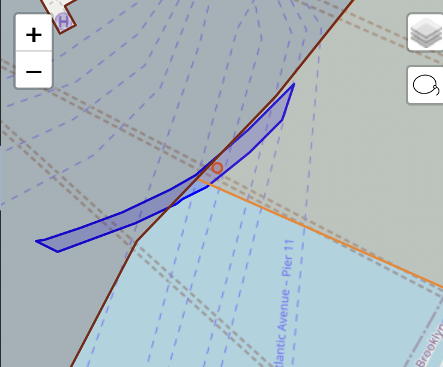

# Bug 002: Police Geography Assignment Differs Near Precinct/Sector Boundaries (ESRI vs. PostGIS Centroid)

**Status:** Understood - not a bug in the new ETL, expected floating-point divergence
**Affected Output:** ThinLION (`police_precinct`, `police_sector`, `patrol_borough`, `police_patrol_borough_command`)
**Severity:** Low - affects a small number of slender/boundary-straddling Atomic Polygons
**Discrepancy Count:** 7 Atomic Polygons citywide (14 diff rows: one in `thinlion_all` plus one in the
relevant borough file, for each). Does not include the separate, already-tracked Bronx
`patrol_borough` XN/XS → BX split, which has its own unrelated cause (temporary FGDB gap).

## Summary

ThinLION assigns `police_precinct`, `police_sector`, `patrol_borough`, and
`police_patrol_borough_command` to each Atomic Polygon (AP) by computing a single
representative point for the AP and testing which NYPD precinct/beat/patrol-borough polygon
contains it (point-in-polygon). For a handful of APs that are thin slivers straddling a
precinct/sector boundary, the representative point sits close enough to the boundary line
that PostGIS's centroid computation lands on the opposite side of the line from whatever the
legacy ESRI-based pipeline computed. The two sides therefore disagree on which precinct/sector
the AP belongs to, even though both are applying the same "centroid, with a fallback for
points that fall outside the polygon" method - they just don't always agree on where exactly
that point lands.

## Technical Details

### The join logic

**Location:** `models/product/thinlion/thinlion_by_field_unformatted.sql:131-159`

For each of the three police geography joins (`stg__nypdprecinct`, `stg__nypdpatrolborough`,
`stg__nypdbeat`), ThinLION computes a representative point per AP and does a point-in-polygon
match:

```sql
-- Spatial joins using point-in-polygon with C# centroid fallback logic
-- First try centroid, if outside polygon use ST_PointOnSurface, else fallback to centroid
LEFT JOIN {{ ref("stg__nypdprecinct") }} AS prec
    ON ST_WITHIN(
        CASE
            WHEN ST_WITHIN(ST_CENTROID(ap.geom), ap.geom) THEN ST_CENTROID(ap.geom)
            WHEN ST_POINTONSURFACE(ap.geom) IS NOT NULL THEN ST_POINTONSURFACE(ap.geom)
            ELSE ST_CENTROID(ap.geom)
        END,
        prec.geom
    )
```

This is a faithful reimplementation of the legacy C# ETL's approach: take the polygon's
centroid, and if the centroid isn't actually inside the polygon (common for concave or
sliver-shaped APs), fall back to a guaranteed-interior point instead. The same
`CASE` block is repeated for `patrol_borough` and `police_sector` (`stg__nypdbeat`), since all
three fields are derived from the identical representative point.

### Why it still disagrees with production

The legacy pipeline computed its centroid using ESRI's geometry engine; this pipeline uses
PostGIS's `ST_CENTROID`/`ST_PointOnSurface`. Both are standard, correct implementations of
"centroid of a polygon" - but they don't necessarily compute the identical floating-point
coordinate, particularly for irregular or very thin polygons. For most APs this makes no
difference: the centroid lands solidly inside one precinct or another, far from any boundary.
But for an AP that is itself a thin sliver running roughly *along* a precinct boundary, the
centroid is, almost by definition, close to that same boundary line - so a small difference in
where exactly ESRI vs. PostGIS place the point is enough to land it on opposite sides.

### Example: Atomic Polygon 1000500093 / 1000500130

These two APs sit on either side of the Manhattan/Brooklyn precinct boundary near Pier 11 /
Atlantic Avenue, where LION models a narrow ferry-slip/roadbed sliver that runs almost exactly
along the boundary line:



The blue outline is the Atomic Polygon; the brown/orange lines are precinct boundaries; the
circle marks the polygon's computed representative point, sitting essentially on top of the
boundary line itself.

```
comparison_id | police_precinct (old → new) | police_sector (old → new) | patrol_borough (old → new)
--------------+------------------------------+----------------------------+------------------------------
1000500093    | 001 → 076               | 1B → 76C               | MS → BS
1000500130    | 076 → 001               | 76C → 1B               | BS → MS
```

Note the two APs flip in opposite directions - consistent with a boundary-adjacent point that
tips one way in one geometry engine and the other way in the other, rather than with either
side being systematically wrong.

The other 5 affected APs (`1000900012`, `1024000006`, `4064102160`, `4071600162`,
`4107202045`) follow the same pattern: each is a small/slender polygon near a precinct or
sector boundary. For details on how to visualize any of these, see
`poc_validation/police_sector_oddities.sql`, which compares the point-in-polygon assignment
against the beat polygon with the largest actual area overlap for a given AP - a useful sanity
check, though not itself the production methodology.

## Root Cause

Floating-point/algorithmic divergence between ESRI's and PostGIS's centroid implementations,
surfaced only for the small set of Atomic Polygons that are thin enough, or close enough to a
precinct/sector boundary, that the exact centroid location matters. Both systems implement the
same intended methodology (centroid, with an inside-the-polygon fallback); neither is
"wrong" in isolation.

## New ETL Implementation

No code change is warranted - the new ETL is a correct implementation of the documented
methodology (`models/product/thinlion/thinlion_by_field_unformatted.sql:131-159`), and matching
ESRI's centroid computation bit-for-bit is out of scope. These are treated as expected,
accounted-for discrepancies. If it ever becomes valuable to reduce disagreement here, a
majority-area-overlap approach would likely be more geometry-engine-independent than a single
representative point, but that would be a deliberate policy change, not a bug fix - see
`poc_validation/police_sector_oddities.sql` for a working comparison of the two approaches.

## Impact Assessment

**Affected Records:** 7 Atomic Polygons citywide (14 rows in `qa__diffs_thinlion_summary`,
since each AP shows up once in `thinlion_all` and once in its borough-specific output).

**Change Pattern:** `police_precinct`, `police_sector`, and (where the AP also crosses a patrol
borough boundary) `patrol_borough`/`police_patrol_borough_command` all change together, since
they're all derived from the same representative point.

**Recommendation:** Marked as `accounted_for = true` in diff tracking alongside the existing
`police_sector`/`patrol_borough`/`police_patrol_borough_command` "police geo discrepancy"
grouping in `qa__diffs_thinlion_summary.sql`.

## References

- Join logic: `models/product/thinlion/thinlion_by_field_unformatted.sql:131-159`
- Diagnostic query: `poc_validation/police_sector_oddities.sql`
- Diff accounting: `models/etl_dev_qa/diffs/thinlion/qa__diffs_thinlion_summary.sql`
