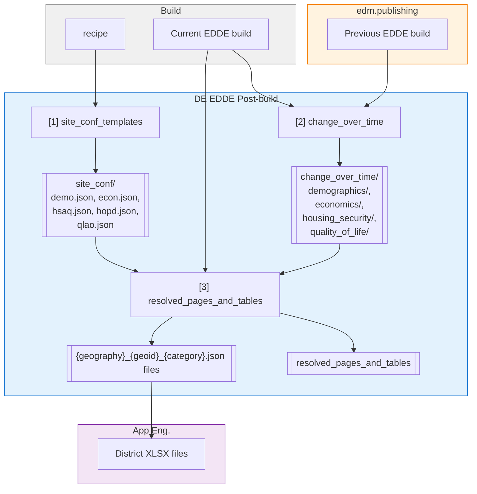

# EDDE Packager

Generates packaged outputs for EDDE data product.

## Output Dependency Graph

## Steps

1. **site_conf_templates** - Renders Jinja2 templates with recipe variables
2. **change_over_time** - Generates change datasets (12 files: 4 categories × 3 geographies)
3. **resolved_pages_and_tables** - Generates final JSON files for equity explorer frontend
